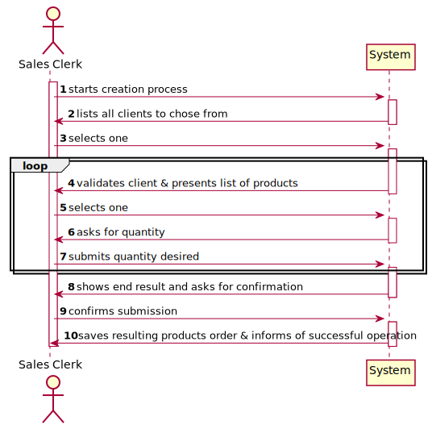
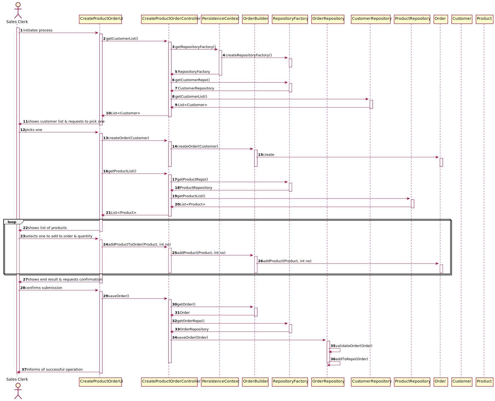
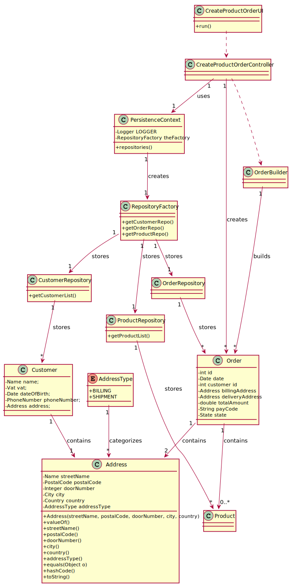

# US1004
=======================================

# 1. Requisitos

**US1004** As Sales Clerk, I want to create a new products order on behalf of a given customer.

A interpretação feita deste requisito foi no sentido de registar um pedido por parte de um cliente no sistema, através da introdução de dados, para este poder navegar a lista total de produtos.

# 2. Análise

## 2.1 Futuras implementações para os outros atores

* Este processo será feito pelo Sales Clerk um dos atores que podem fazer esta ação, sendo os outros
atores o próprio cliente e um sales manager. Por este motivo esta ação será partilha por todos, logo iremos fazer esforços para que os
outros atores (o cliente e o sales manager) possam reutilizar o código desenvolvido. *

## 2.2 Sequência das ações

* O sales clerk irá perguntar ao customer o seu id, que servirá para atribuir à class Order, e também o seu endereço para billing e delivery. De seguida o SalesClerk irá apresentar a lista de produtos, e o cliente escolherá quais produtos deseja e quantos do mesmo.
De seguida, o pedido será  apresentado ao cliente, que, após confirmado, será criado e armazenado na base de dados.

## 2.3 Regras de negócio associadas aos atributos de um Order

* OrderState: Correspode ao estado em que se encontra uma order, no que se refere à sua entrega. Por defeito, todas as orders deverão ser criadas no estado "REGISTERED"
* Payment: Método de pagamento da Order.
* Shipment: Método de entrega da Order.
* CustomerID: Corresponde à identificação do cliente ao qual está dirigida a Order.
* DateCreated: Data de criação da Order

## 2.4 Pré Condições

n/a.

## 2.5 Pós Condições

A informação dos Orders é persistida.

## 2.6 SSD

# 3. Design

Foi usado o pattern fábrica, de modo a não expor a lógica de instanciação do Order. Isto será realizado através da implementação "DomainFactory" da framework de EAPLI.

## 3.1. Realização da Funcionalidade

## 3.2. Diagrama de Classes

## 3.3. Padrões Aplicados

* Foi utilizado o CRUD (Create, Read, Update, Delete) para trabalhar sobre os Orders.

* Foi utilizado o GRASP:

* Foi utilizado o Builder, já que há certos atributos que são opcionais. O padrão builder dá-nos um processo passo a passo
para construir um objeto completo. Este processo tem sempre a mesma implementação, porém os objetos finais podem possuir
diferentes representações. Neste contexto o processo irá passar por criar os atributos obrigatórios de construtor, dando
a possibilidade de definir apenas alguns atributos opcionais.

* Foram utilizados o padrão repository, de modo a isolar os objetos de domínio de lógica de bases de dados. Os nossos objetos
de domínio, que por já são complexos contendo muitas regras de domínio para impor, beneficia de outra camada onde apenas
teremos lógica de bases de dados. Isto ajuda-nos a reduzir código duplicado, fazendo com que a layer de repositório
possua capacidades de fazer querying complexo. Um repositório encapsula a lista de objetos persistidos numa base de dados
dando-nos uma visão orientada a objetos à camada de persitência.

## 3.4. Testes
*Nesta secção deve sistematizar como os testes foram concebidos para permitir uma correta aferição da satisfação dos requisitos.*

**Teste 1:** Verificar que não é possível criar uma instância da classe Order com valores nulos.

**Teste 2.** Verificar que não  é possível criar uma instância da classe Order com apenas certo valores nulos (i.e: customerID, dateCreated, billingAddress, deliveryAddress, totalAmount)

# 4. Implementação

## 4.1. Builder

	public OrderBuilder(){

	}

	public OrderBuilder(final Long customerId, final Address deliveryAddress, final Address billingAddress){
	this.customerId = customerId;
	this.deliveryAddress= deliveryAddress;
	this.billingAddress = billingAddress;
	}

	public OrderBuilder addProduct(Product product, Integer quantity){
	this.productIntegerMap.put(product,quantity);
	this.totalAmount = calculateTotalAmount();
	return this;
	}

	private Price calculateTotalAmount(){
	this.totalAmount.clear();
	Double d = 0.0;
	Double d2 = 0.0;
	for (Product p : productIntegerMap.keySet()) {
			d = d + p.getPrice().priceWithTaxes() * productIntegerMap.get(p);
			d2 = d2 + p.getPrice().priceWithoutTaxes() * productIntegerMap.get(p);

	}
	Price price = new Price(d2,d);
	this.totalAmount = price;
	return this.totalAmount;
	}

	@Override
	public ProductOrder build() {
	return new ProductOrder(LocalDate.now(),
					this.customerId, this.deliveryAddress,
					this.billingAddress, this.productIntegerMap,
					this.totalAmount, this.payment, this.shipment);
	}

	@Override
	public String toString(){
	return "ProductOrder: \n" +
					"----------------------------" + "\n" +
					"Customer Id:                " + this.customerId + "\n" +
					"Billing Address:            " + this.billingAddress.shortToString() + "\n" +
					"Delivery Address:           " + this.deliveryAddress.shortToString() + "\n" +
					"Total Amount With Taxes:    " + String.format("%.2f", this.totalAmount.priceWithTaxes()) + "\n" +
					"Total Amount Without Taxes: " + String.format("%.2f", this.totalAmount.priceWithoutTaxes()) + "\n" +
					"----------------------------" + "\n" +
					"Products Ordered: \n" +
					productListToString() +
					"----------------------------" + "\n";
	}

	private String productListToString() {
	String productList = "";
	for (Product product: this.productIntegerMap.keySet()) {
			productList += String.format(this.productIntegerMap.get(product).toString() + " x " + product.getName() + "  " + product.getUnitPriceDouble() + "EUR"+ "\n");
	}

	return productList;
	}
	}

## 4.2 CreateProductOrderController

	public class CreateProductOrderController {

	private final AuthorizationService authz = AuthzRegistry.authorizationService();

	private OrderBuilder OB;

	private CustomerRepository cRepo = PersistenceContext.repositories().customers();
	private OrderRepository oRepo = PersistenceContext.repositories().orders();

	private final CheckProductCatalogService productCatalogService= new CheckProductCatalogService();

	public CreateProductOrderController(){
		 //authz.ensureAuthenticatedUserHasAnyOf(BaseRoles.POWER_USER, BaseRoles.ADMIN, BaseRoles.SALES_CLERK);
	}

	public List<Customer> getCustomerList(){
		 List<Customer> actualList = new ArrayList<>();
		 this.cRepo.findAll().iterator().forEachRemaining(actualList::add);
		 return actualList;
	}

	public void createOrder(Long customerId, Address delivery, Address billing){
		 this.OB = new OrderBuilder(customerId,delivery,billing);
	}

	public List<Product> getProductList(){
		 List<Product> actualList = new ArrayList<>();
		 productCatalogService.allProducts().iterator().forEachRemaining(actualList::add);
		 return actualList;
	}

	public void addProductToOrder(Product product, int quantity){
		 this.OB = this.OB.addProduct(product,quantity);
	}

	public String showOrderBuilder(){
		 return this.OB.toString();
	}

	public ProductOrder saveOrder(){
		 ProductOrder newProductOrder = this.OB.build();

		 return this.oRepo.save(newProductOrder);
	}

	}

## CreateProductOrderUI
	public class CreateProductOrderUI extends AbstractUI {

	private final CreateProductOrderController ctrl = new CreateProductOrderController();

	@Override
	public boolean doShow() {
			List<Customer> lCustomer = this.ctrl.getCustomerList();
			int c = 1;

		System.out.print("Customer List: \n" +
						"--------------------------------------------------------------\n");
		for (Customer customer: lCustomer ) {
				System.out.println(c + " - " + customer.identity() + ", " + customer.name());
				c++;
		}
		System.out.print("\n" +
						"0 - to cancel operation");
		System.out.print("--------------------------------------------------------------\n");
		Customer customer = (Customer) Utils.selectsObject(lCustomer);

		this.ctrl.createOrder(customer.identity(),customer.defaultAddress(),customer.defaultAddress());

		List<Product> lProd = this.ctrl.getProductList();

		int n = 1;

		System.out.print("\n\nProduct List: \n" +
												"--------------------------------------------------------------\n");
		for (Product prod: lProd) {
				System.out.println(n + " - " + prod.getName() + " - " + prod.getPrice().priceWithTaxes()+ "EUR");
				n++;
		}
		System.out.print("\n" +
						"0 - to finish adding products\n");
		System.out.print("--------------------------------------------------------------\n");

		int i = -1;
		int quantity;
		while(i != 0) {
				i = Utils.readIntegerFromConsole("Select a Product to add to order: ");
				if(i == 0) {
						break;
				}
				quantity = Utils.readIntegerFromConsole("Select how many: ");
				this.ctrl.addProductToOrder(lProd.get(i-1), quantity);
				System.out.println( quantity + "x " + lProd.get(i-1).getName().toString() + " added successfully!");
		}

		System.out.println("Resulting product order class: ");
		System.out.println(this.ctrl.showOrderBuilder());

		String confirmation = null;
		do {
				confirmation= Utils.readLineFromConsole("Do you wish to create this order?(Y/N)");
				if(confirmation.equalsIgnoreCase("y")) {

						ProductOrder newProductOrder = this.ctrl.saveOrder();

						if(newProductOrder != null) {
								System.out.println(newProductOrder);
								System.out.print("Operation successfully completed!\n");
								break;
						} else {
								System.out.println("Oh no! Something went wrong when creating the ProductOrder!\n");
								break;
						}
				} else if (confirmation.equalsIgnoreCase("n")) {
						System.out.print("Operation successfully canceled!\n");
						break;
				} else {
						System.out.println("Enter Y to confirm, or N to cancel the order!");
				}

		}while(!confirmation.equalsIgnoreCase("y") || !confirmation.equalsIgnoreCase("n"));

		return false;
	}
	public String headline() {
			return "Place Product Order";
	}
	}

# 5. Integração/Demonstração

- Foi adicionada uma opção (Product -> Place New Order) ao menu do SalesClerk.

- Devem ser inseridas as informações do Order, tendo o sistema verificações de forma a cumprir os requisitos fornecidos pelo sales clerk.
# 6. Observações
