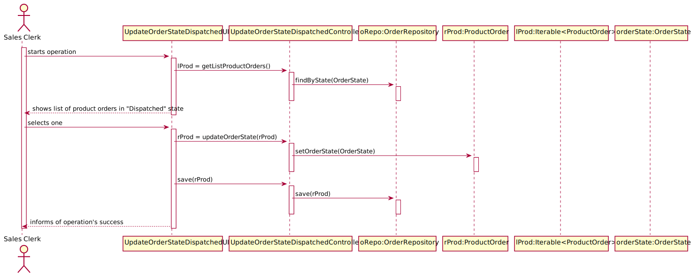

# US1006
=======================================

# 1. Requisitos

**US1006** As Sales Clerk, I want to access a list of orders that had been dispatched for customer delivery and be able to update some of those orders to as being delivered.

A interpretação feita deste requisito foi no sentido de visualizar e atualizar o estado de product orders no estado "DISPATCHED" para "DELIVERED".

# 2. Análise

## 2.1 Futuras implementações para os outros atores

* Este processo será feito pelo Warehouse Employee, um dos atores que podem fazer esta ação. Por este motivo esta ação não será partilhada por todos. *

## 2.2 Sequência das ações

* O warehouse employee irá iniciar o processo de visualização de lista de encomendas preparadas, de seguida poderá atualizar uma dessas encomendas para o estado "DELIVERED" *

## 2.3 Regras de negócio associadas aos atributos de um ProductOrder

* OrderState: Correspode ao estado em que se encontra uma order, no que se refere à sua entrega. Por defeito, todas as orders deverão ser criadas no estado "REGISTERED"

## 2.4 Pré Condições

* Existirem ProductOrders no sistema no estado "DISPATCHED".

## 2.5 Pós Condições

A informação das ProductOrders é persistida.

## 2.6 SSD

# 3. Design

## 3.1. Realização da Funcionalidade

## 3.2. Diagrama de Classes

## 3.3. Padrões Aplicados

* Foi utilizado o CRUD (Create, Read, Update, Delete) para trabalhar sobre os ProductOrders.

* Foi utilizado o GRASP:

* Foi utilizado o Builder. O padrão builder dá-nos um processo passo a passo
para construir um objeto completo. Este processo tem sempre a mesma implementação, porém os objetos finais podem possuir
diferentes representações. Neste contexto o processo irá passar por criar os atributos obrigatórios de construtor, dando
a possibilidade de definir apenas alguns atributos opcionais. Exemplo: AGV com AGVDock, mas sem AGVState.

* Foram utilizados o padrão repository, de modo a isolar os objetos de domínio de lógica de bases de dados. Os nossos objetos
de domínio, que por já são complexos contendo muitas regras de domínio para impor, beneficia de outra camada onde apenas
teremos lógica de bases de dados. Isto ajuda-nos a reduzir código duplicado, fazendo com que a layer de repositório
possua capacidades de fazer querying complexo. Um repositório encapsula a lista de objetos persistidos numa base de dados
dando-nos uma visão orientada a objetos à camada de persitência.

## 3.4. Testes
*Nesta secção deve sistematizar como os testes foram concebidos para permitir uma correta aferição da satisfação dos requisitos.*

**Teste 1:** verificar que as ProductOrder são atualizadas na base de dados

# 4. Implementação

## UpdateOrderStateDispatchedUI

public class UpdateOrderStateDispatchedUI extends AbstractUI {

    UpdateOrderStateDispatchedController ctrl = new UpdateOrderStateDispatchedController();

    @Override
    protected boolean doShow() {

        Iterable<ProductOrder> lProdOrder = ctrl.getListProductOrders();
        int i = 1;

        System.out.print("Order List: \n" +
                "--------------------------------------------------------------\n");
        for (ProductOrder prod : lProdOrder ) {
            if(prod.getOrderState().toString().equals(OrderState.DISPATCHED.toString())){
                System.out.println(i + " - \n" + prod.shortToString());
                i++;
            }
        }
        System.out.print("\n" +
                "0 - to cancel operation");
        System.out.print("--------------------------------------------------------------\n");
        ProductOrder rProductOrder = (ProductOrder) Utils.selectsObject((List) lProdOrder);

        if (rProductOrder == null){
            System.out.print("No Product Order selected! (Null Product Order)\n");
            return false;
        }

        System.out.println();

        String confirmation = null;
        do {
            confirmation= Utils.readLineFromConsole("Do you wish to update ProductOrder#" + rProductOrder.identity() + "'s state to DELIVERED?(Y/N)\"");
            if(confirmation.equalsIgnoreCase("y")) {
                ProductOrder nProductOrder = rProductOrder;

                if(this.ctrl.changeOrderState(nProductOrder)){
                    this.ctrl.save(nProductOrder,rProductOrder);
                    System.out.print("--------------------------------------------------------------\n" +
                            "Operation successful!" + "\n" +
                            "--------------------------------------------------------------\n" +
                            "Here is the list of DELIVERED Product Orders:" + "\n" +
                            this.ctrl.printBeingPreparedProductOrders() + "\n" +
                            "--------------------------------------------------------------\n");
                    break;
                } else {
                    System.out.print("--------------------------------------------------------------\n" +
                            "Operation unsuccessful!" + "\n" +
                            "--------------------------------------------------------------\n");
                    break;
                }

            } else if (confirmation.equalsIgnoreCase("n")) {
                System.out.print("Operation successfully canceled!\n");
                break;
            } else {
                System.out.println("Enter Y to confirm, or N to cancel the order!");
            }

        }while(!confirmation.equalsIgnoreCase("y") || !confirmation.equalsIgnoreCase("n"));

        return false;
    }

# 5. Integração/Demonstração

- Foi adicionada a opção (Warehouse Management -> Update Product Order to BEING_DELIVERED) as menu do Warehouse Employee
- Deve ser escolhida uma ProductOrder.

# 6. Observações
