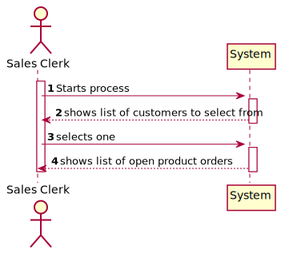
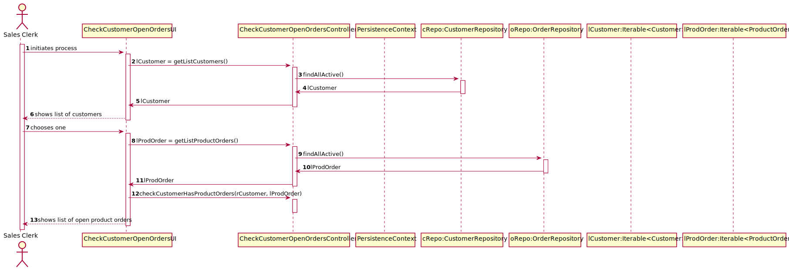
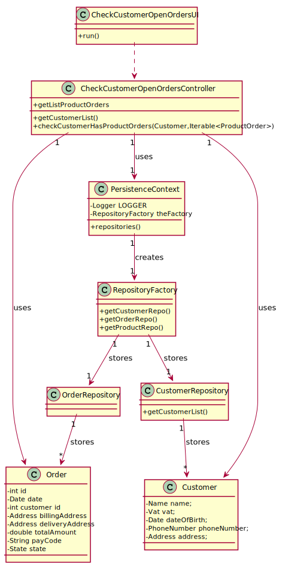

# US1502
=======================================

# 1. Requisitos

**US1502** As Customer, I want to view/check the status of my open orders.

A interpretação feita deste requisito foi no sentido de devolver ao end user, uma lista de todas as instâncias de ProductOrder's cujo estado seja diferente de "DELIVERED".

# 2. Análise

## 2.1 Futuras implementações para os outros atores

* Este processo será feito pelo Warehouse Employee, um dos atores que podem fazer esta ação. Por este motivo esta ação não será partilhada por todos. *

## 2.2 Sequência das ações

* O warehouse employee irá iniciar o processo de visualização de lista de encomendas preparadas, de seguida deverá escolher um cliente cujas orders visualizar.

## 2.3 Regras de negócio associadas aos atributos de um ProductOrder

* OrderState: Correspode ao estado em que se encontra uma order, no que se refere à sua entrega. Por defeito, todas as orders deverão ser criadas no estado "REGISTERED"

* Customer: Corresponde a um cliente.

## 2.4 Pré Condições

* Existirem ProductOrders no sistema no estado diferente de "DELIVERED" atribuídas ao cliente escolhido.

## 2.5 Pós Condições

A informação das ProductOrders é persistida.

## 2.6 SSD

# 3. Design

## 3.1. Realização da Funcionalidade

## 3.2. Diagrama de Classes

## 3.3. Padrões Aplicados

* Foi utilizado o CRUD (Create, Read, Update, Delete) para trabalhar sobre os ProductOrders.

* Foi utilizado o GRASP:

* Foi utilizado o Builder. O padrão builder dá-nos um processo passo a passo
para construir um objeto completo. Este processo tem sempre a mesma implementação, porém os objetos finais podem possuir
diferentes representações. Neste contexto o processo irá passar por criar os atributos obrigatórios de construtor, dando
a possibilidade de definir apenas alguns atributos opcionais. Exemplo: AGV com AGVDock, mas sem AGVState.

* Foram utilizados o padrão repository, de modo a isolar os objetos de domínio de lógica de bases de dados. Os nossos objetos
de domínio, que por já são complexos contendo muitas regras de domínio para impor, beneficia de outra camada onde apenas
teremos lógica de bases de dados. Isto ajuda-nos a reduzir código duplicado, fazendo com que a layer de repositório
possua capacidades de fazer querying complexo. Um repositório encapsula a lista de objetos persistidos numa base de dados
dando-nos uma visão orientada a objetos à camada de persitência.

## 3.4. Testes
*Nesta secção deve sistematizar como os testes foram concebidos para permitir uma correta aferição da satisfação dos requisitos.*

**Teste 1:** verificar que as ProductOrder são atualizadas na base de dados

# 4. Implementação

## CheckCustomerOpenOrdersUI

public class CheckCustomerOpenOrdersUI extends AbstractUI {

    CheckCustomerOpenOrdersController ctrl = new CheckCustomerOpenOrdersController();

    @Override
    protected boolean doShow() {
        Iterable<Customer> lCustomer = ctrl.getListCustomers();
        int i = 1;

        System.out.print("Customer List: \n" +
                "--------------------------------------------------------------\n");
        for (Customer customer : lCustomer ) {
            System.out.println(i + " - \n" + customer.name() +", " + customer.identity() + ", " + customer.email());
            i++;
        }
        System.out.print("\n" +
                "0 - to cancel operation");
        System.out.print("--------------------------------------------------------------\n");
        Customer rCustomer = (Customer) Utils.selectsObject((List) lCustomer);

        if (rCustomer == null){
            System.out.print("No Customer selected! (Null Customer)\n");
            return false;
        }

        Iterable<ProductOrder> lProdOrder = ctrl.getListProductOrders();
        i = 1;

        if(!ctrl.checkCustomerHasProductOrders(rCustomer,lProdOrder)){
            System.out.println("\nCustomer has no open Product Orders in the database!");
            return false;
        }

        System.out.print("\nOrder List: \n" +
                "--------------------------------------------------------------\n");
        for (ProductOrder prod : lProdOrder ) {
            if(Objects.equals(prod.getCustomerId(), rCustomer.identity()) && !prod.getOrderState().toString().equals(OrderState.DELIVERED.toString())){
                System.out.println(i + " - \n" + prod.toString());
                i++;
            }
        }
        System.out.print("\n--------------------------------------------------------------\n");
        return false;
    }

# 5. Integração/Demonstração

- Foi adicionada a opção (Warehouse Management -> Update Product Order to DISPATCHED) as menu do Warehouse Employee
- Deve ser escolhida uma ProductOrder.

# 6. Observações
