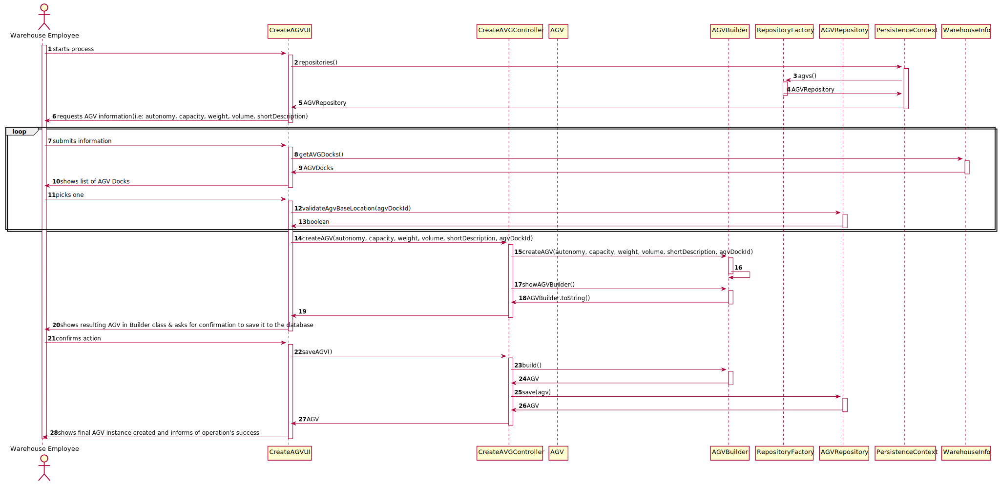

# US2002
=======================================

# 1. Requisitos

**US2002** As Warehouse Employee, I want to configure the AGVs available on the warehouse.

A interpretação feita deste requisito foi no sentido de configurar um AGV no sistema, através da introdução de dados, pare este poder estar numa Warehouse onde tem uma AGV Dock dedicada.

# 2. Análise

## 2.1 Futuras implementações para os outros atores

* Este processo será feito pelo Warehouse Employee, um dos atores que podem fazer esta ação. Por este motivo esta ação não será partilhada por todos. *

## 2.2 Sequência das ações

* O warehouse employee irá iniciar a configuração do AGV. O sistem irá lhe requerir a informação do AGV.
Logo, após preencher a informação requirida, o ator será apresentado com uma lista de AGV Docks para associar o AGV à mesma. De seguida, o AGV será guardado na base de dados. *

## 2.3 Regras de negócio associadas aos atributos de um AGV

* AGV Dock: uma, e apenas uma, AGV Dock terá de ser associada ao AGV para o mesmo poder executar as suas ações.
* AGV State: conjunto de ações que caraterizam o estado atual do AGV. Não será um parametro na construção do AGV, logo quando o AGV é criado, por defeito será atribuida o estado "FREE".

## 2.4 Pré Condições

n/a.

## 2.5 Pós Condições

A informação dos AGVs é persistida.

## 2.6 SSD

# 3. Design

Foi usado o pattern fábrica, de modo a não expor a lógica de instanciação do AGV. Isto será realizado através da implementação "DomainFactory" da framework de EAPLI.

## 3.1. Realização da Funcionalidade

## 3.2. Diagrama de Classes

## 3.3. Padrões Aplicados

* Foi utilizado o CRUD (Create, Read, Update, Delete) para trabalhar sobre os AGV.

* Foi utilizado o GRASP:

* Foi utilizado o Builder. O padrão builder dá-nos um processo passo a passo
para construir um objeto completo. Este processo tem sempre a mesma implementação, porém os objetos finais podem possuir
diferentes representações. Neste contexto o processo irá passar por criar os atributos obrigatórios de construtor, dando
a possibilidade de definir apenas alguns atributos opcionais. Exemplo: AGV com AGVDock, mas sem AGVState.

* Foram utilizados o padrão repository, de modo a isolar os objetos de domínio de lógica de bases de dados. Os nossos objetos
de domínio, que por já são complexos contendo muitas regras de domínio para impor, beneficia de outra camada onde apenas
teremos lógica de bases de dados. Isto ajuda-nos a reduzir código duplicado, fazendo com que a layer de repositório
possua capacidades de fazer querying complexo. Um repositório encapsula a lista de objetos persistidos numa base de dados
dando-nos uma visão orientada a objetos à camada de persitência.

## 3.4. Testes
*Nesta secção deve sistematizar como os testes foram concebidos para permitir uma correta aferição da satisfação dos requisitos.*

**Teste 1:** Verificar que não é possível criar uma instância da classe AGV com valores nulos.

# 4. Implementação

## 4.1. Builder

	public class AGVBuilder implements DomainFactory<AGV> {

	private Integer autonomy;
	private Double capacity;
	private String shortDescription;
	private Double weight;
	private Double volume;

	private AGVState agvState = null;

	private DockingPoint agvDocks;

	public AGVBuilder(){

	}

	public AGVBuilder createAGV(Integer autonomy, Double capacity, Double weight, Double volume, String shortDescription
															, DockingPoint dockingPoint){
			this.shortDescription = shortDescription;
			this.capacity = capacity;
			this.autonomy = autonomy;
			this.weight = weight;
			this.volume = volume;
			this.agvDocks = dockingPoint;
			return this;
	}

	public AGVBuilder withAGVState(AGVState agvState){
			this.agvState = agvState;
			return this;
	}

	public AGVBuilder withAGVDock(DockingPoint agvDock){
			this.agvDocks = agvDock;
			return this;
	}

	/*public AGVBuilder withAGVModel(AGVModel agvModel){
			this.agvModel = agvModel;
			return this;
	}
	*/

	@Override
	public AGV build() {
			return new AGV(this.autonomy,this.capacity,this.weight,this.volume,this.shortDescription, this.agvDocks);
	}

	@Override
	public String toString(){
			return "AGV: " + "\n" +
							"----------------------------" + "\n" +
							"Autonomy (minutes):         " + this.autonomy +"\n" +
							"Capacity (kg):              " + String.format("%.2f", this.capacity) + "\n" +
							"Weight (kg):                " + String.format("%.2f", this.weight) + "\n" +
							"Volume (dm^3):              " + String.format("%.2f", this.volume) + "\n" +
							"Short Description:          " + shortDescription + "\n" +
							"Base Location (AGV Dock):   " + this.agvDocks + "\n" +
							"----------------------------" + "\n";
	}
	}

## 4.2 CreateAGVController

	public class CreateAGVController {

	private AGVBuilder AB;
	private AGVRepository aRepo = PersistenceContext.repositories().agvs();

	public CreateAGVController()  {
		 AB = new AGVBuilder();
	}

	public void createAGV(Integer autonomy, Double capacity, Double weight, Double volume
										 , String shortDescription, DockingPoint dockingPoint) {
		 this.AB = AB.createAGV(autonomy, capacity, weight, volume, shortDescription, dockingPoint);
	}

	public String showAGVBuilder() {
		 return this.AB.toString();
	}

	public AGV saveAGV() {
		 AGV agv = AB.build();
		 return this.aRepo.save(agv);
	}

	}

## CreateAGVUI

	protected boolean doShow() {

			Integer autonomy = null;
			if (validation) {
					do {
							try {
									autonomy = Integer.parseInt(Console.readLine("Introduce the AGV autonomy: "));
									validation = true;
							} catch (NumberFormatException exception) {
									System.out.println(exception.getMessage());
									validation = false;
							}

					}
					while (!validation);

					Double capacity = null;
					do {
							try {
									capacity = Double.parseDouble(Console.readLine("Introduce the AGV capacity: "));
									validation = true;
							} catch (NumberFormatException exception) {
									System.out.println(exception.getMessage());
									validation = false;
							}
					} while (!validation);

					Double weight = null;
					do {
							try {
									weight = Double.parseDouble(Console.readLine("Introduce the AGV weight: "));
									validation = true;
							} catch (NumberFormatException exception) {
									System.out.println(exception.getMessage());
									validation = false;
							}
					}
					while (!validation);

					Double volume = null;
					do {
							try {
									volume = Double.parseDouble(Console.readLine("Introduce the AGV volume: "));
									validation = true;
							} catch (NumberFormatException exception) {
									System.out.println(exception.getMessage());
									validation = false;
							}
					} while (!validation);

					String shortDescription;
					do {
							shortDescription = Console.readLine("Introduce the AGV short description: ");

							if (shortDescription.isEmpty() || shortDescription.length() > 30) {
									System.out.println("This field can't be empty and must have a maximum of 30 chars.");
							}
					} while (shortDescription.isEmpty() || shortDescription.length() > 30);

					AGVDocks agvDock;
					boolean a = false;
					do {
							agvDock = selectAgvDock(warehouseInfo);

							a = repo.validateAgvBaseLocation(agvDock.getId());

					}while(!a);

					DockingPoint dockingPoint = new DockingPoint(agvDock.getId());

					System.out.println(dockingPoint);

					this.ctrl.createAGV(autonomy, capacity, weight, volume, shortDescription, dockingPoint);

					System.out.println("Resulting AGV class: ");
					System.out.println(this.ctrl.showAGVBuilder());

					String confirmation = null;
					do {
							confirmation= Utils.readLineFromConsole("Do you wish to create this AGV?(Y/N)");
							if(confirmation.equalsIgnoreCase("y")) {
									AGV newAGV = this.ctrl.saveAGV();

									if(newAGV != null) {
											System.out.println(newAGV);
											System.out.print("Operation successfully completed!\n");
											break;
									} else {
											System.out.println("Oh no! Something went wrong when creating the AGV!\n");
											break;
									}
							} else if (confirmation.equalsIgnoreCase("n")) {
									System.out.print("Operation successfully canceled!\n");
									break;
							} else {
									System.out.println("Enter Y to confirm, or N to cancel the AGV!");
							}

					}while(!confirmation.equalsIgnoreCase("y") || !confirmation.equalsIgnoreCase("n"));
			}
			return false;
	}

	public AGVDocks selectAgvDock(WarehouseInfo warehouseInfo) {
			assert warehouseInfo != null;
			final Iterable<AGVDocks> agvDocks = warehouseInfo.getAVGDocks();
			final SelectWidget<AGVDocks> agvDockSelector = new SelectWidget<>("Agv Docks: ", agvDocks, new AgvDockPrinter());
			agvDockSelector.show();
			return agvDockSelector.selectedElement();
	}

	@Override
	public String headline() {
			return "Configure AGV";
	}
	}

# 5. Integração/Demonstração

- Foi adicionada a opção (Warehouse Management -> Configure a new AGV) as menu do Warehouse Employee
- Devem ser inseridas as informações do AGV, tendo o sistema verificadas de forma a cumprir os requisitos fornecidos.
- Deve ser atribuída uma só AGV Dock ao AGV, tendo em conta que não pode haver 2 AGV com a mesma AGV Dock.

# 6. Observações
