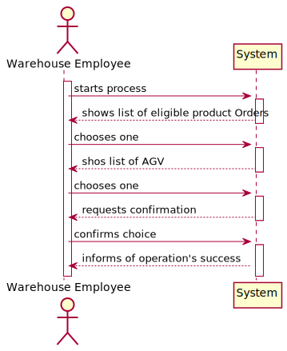
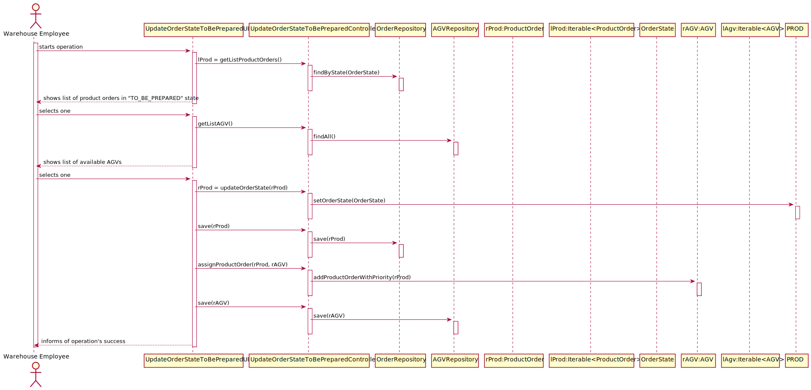
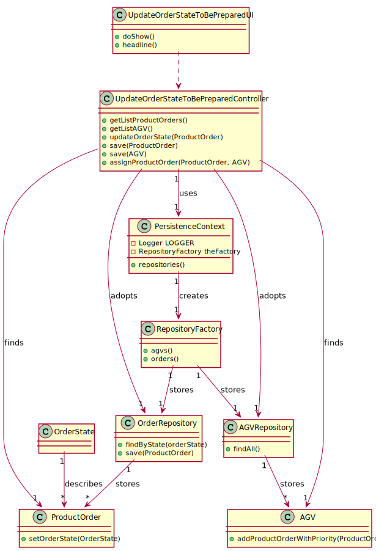

# US2003
=======================================

# 1. Requisitos

**US2003** As Warehouse Employee, I want to access the list of orders that need to be prepared by an AGV and be able to ask/force any of those orders to be immediately prepared by an AGV available.

A interpretação feita deste requisito foi no sentido de devolver ao end user, uma lista de todas as instâncias de ProductOrder's cujo estado seja "TO_BE_PREPARED"; consequentemente, deverá haver opção de priorizar essa ProductOrder para um AGV começar a prepará-la.

# 2. Análise

## 2.1 Futuras implementações para os outros atores

* Este processo será feito pelo Warehouse Employee, um dos atores que podem fazer esta ação. Por este motivo esta ação não será partilhada por todos. *

## 2.2 Sequência das ações

* O warehouse employee irá iniciar o processo de visualização de lista de encomendas preparadas, de seguida poderá atualizar uma dessas encomendas para o estado "BEING_PREPARED" *

## 2.3 Regras de negócio associadas aos atributos de um ProductOrder

* OrderState: Correspode ao estado em que se encontra uma order, no que se refere à sua entrega. Por defeito, todas as orders deverão ser criadas no estado "REGISTERED"

## 2.4 Pré Condições

* Existirem ProductOrders no sistema no estado "TO_BE_PREPARED".

## 2.5 Pós Condições

A informação das ProductOrders é persistida.

## 2.6 SSD

# 3. Design

Foi usado o pattern fábrica, de modo a não expor a lógica de instanciação do AGV. Isto será realizado através da implementação "DomainFactory" da framework de EAPLI.

## 3.1. Realização da Funcionalidade

## 3.2. Diagrama de Classes

## 3.3. Padrões Aplicados

* Foi utilizado o CRUD (Create, Read, Update, Delete) para trabalhar sobre os AGV.

* Foi utilizado o GRASP:

* Foi utilizado o Builder. O padrão builder dá-nos um processo passo a passo
para construir um objeto completo. Este processo tem sempre a mesma implementação, porém os objetos finais podem possuir
diferentes representações. Neste contexto o processo irá passar por criar os atributos obrigatórios de construtor, dando
a possibilidade de definir apenas alguns atributos opcionais. Exemplo: AGV com AGVDock, mas sem AGVState.

* Foram utilizados o padrão repository, de modo a isolar os objetos de domínio de lógica de bases de dados. Os nossos objetos
de domínio, que por já são complexos contendo muitas regras de domínio para impor, beneficia de outra camada onde apenas
teremos lógica de bases de dados. Isto ajuda-nos a reduzir código duplicado, fazendo com que a layer de repositório
possua capacidades de fazer querying complexo. Um repositório encapsula a lista de objetos persistidos numa base de dados
dando-nos uma visão orientada a objetos à camada de persitência.

## 3.4. Testes
*Nesta secção deve sistematizar como os testes foram concebidos para permitir uma correta aferição da satisfação dos requisitos.*

**Teste 1:** Verificar que não é possível criar uma instância da classe AGV com valores nulos.

# 4. Implementação

## 4.1 UpdateOrderStateTobePreparedController

public class UpdateOrderStateToBePreparedController {

    private OrderRepository oRepo = PersistenceContext.repositories().orders();
    private AGVRepository aRepo = PersistenceContext.repositories().agvs();

    public UpdateOrderStateToBePreparedController (){

    }

    public Iterable<ProductOrder> getListProductOrders() {
        return this.oRepo.findByState(OrderState.TO_BE_PREPARED);
    }

    public Iterable<AGV> getListAGV() {
        return this.aRepo.findAll();
    }

    public boolean assignProductOrder(ProductOrder rProductOrder, AGV rAGV) {
        return rAGV.addProductOrderWithPriority(rProductOrder);
    }

    public AGV save(AGV agv,AGV oldAGV){
        aRepo.remove(oldAGV);
        return this.aRepo.save(agv);
    }

    public ProductOrder save(ProductOrder nProd, ProductOrder oProd){
        return this.oRepo.save(nProd);
    }

    public ProductOrder updateOrderState(ProductOrder productOrder){
        productOrder.setOrderState(OrderState.BEING_PREPARED);
        return productOrder;
    }

    public boolean checkAssignProductOrder(ProductOrder rProductOrder, AGV rAGV) {
        return !rAGV.getProductOrderQueue().contains(rProductOrder);
    }
}

## 4.2 UpdateOrderStateTobePreparedUI

public class UpdateOrderStateToBePreparedUI extends AbstractUI {

	UpdateOrderStateToBePreparedController ctrl = new UpdateOrderStateToBePreparedController();

	@Override
	protected boolean doShow() {

			Iterable<ProductOrder> lProdOrder = ctrl.getListProductOrders();
			int i = 1;

			System.out.print("Order List: \n" +
							"--------------------------------------------------------------\n");
			for (ProductOrder prod : lProdOrder ) {
					if(prod.getOrderState().toString().equals(OrderState.TO_BE_PREPARED.toString())){
							System.out.println(i + " - \n" + prod.shortToString());
							i++;
					}
			}
			System.out.print("\n" +
							"0 - to cancel operation");
			System.out.print("--------------------------------------------------------------\n");
			ProductOrder rProductOrder = (ProductOrder) Utils.selectsObject((List) lProdOrder);

			if (rProductOrder.equals(null)){
					System.out.printf("No Product Order selected! (Null Product Order");
					return false;
			}

			i = 1;
			Iterable<AGV> lAGV = ctrl.getListAGV();
			System.out.print("AGV List: \n" +
							"--------------------------------------------------------------\n");
			for (AGV agv : lAGV ) {
					System.out.println(i + " - " + agv.toString());
					i++;
			}
			System.out.print("\n" +
							"0 - to cancel operation");
			System.out.print("--------------------------------------------------------------\n");
			AGV rAGV = (AGV) Utils.selectsObject((List) lAGV);

			if(rAGV.equals(null)){
					System.out.println("No object selected! (Null AGV)");
					return false;
			}

			System.out.println();

			String confirmation = null;
			do {
					confirmation= Utils.readLineFromConsole("Do you wish to assign AGV#" + rAGV.identity() + " to prepare ProductOrder#" + rProductOrder.identity() + "?(Y/N)\"");
					if(confirmation.equalsIgnoreCase("y")) {
							AGV nAGV = rAGV;
							ProductOrder nProductOrder = rProductOrder;

							System.out.println(rAGV.printTaskOrder());

							if(this.ctrl.checkAssignProductOrder(rProductOrder, rAGV)){
									rProductOrder = this.ctrl.updateOrderState(rProductOrder);
									this.ctrl.save(rProductOrder,nProductOrder);
									this.ctrl.assignProductOrder(rProductOrder,rAGV);
									this.ctrl.save(rAGV, nAGV);
									System.out.print("--------------------------------------------------------------\n" +
													"Operation successful!" + "\n" +
													"--------------------------------------------------------------\n" +
													"Here is AGV#" + rAGV.identity() + "'s updated task list:" + "\n" +
													rAGV.printTaskOrder() + "\n" +
													"--------------------------------------------------------------\n");
									break;
							} else {
									System.out.print("--------------------------------------------------------------\n" +
													"Operation unsuccessful!" + "\n" +
													"--------------------------------------------------------------\n");
									break;
							}

					} else if (confirmation.equalsIgnoreCase("n")) {
							System.out.print("Operation successfully canceled!\n");
							break;
					} else {
							System.out.println("Enter Y to confirm, or N to cancel the order!");
					}

			}while(!confirmation.equalsIgnoreCase("y") || !confirmation.equalsIgnoreCase("n"));

			return false;
	}

	@Override
	public String headline() {
			return "Update Product Order to be Prepared";
	}
}

# 5. Integração/Demonstração

- Foi adicionada a opção (Warehouse Management -> Configure a new AGV) as menu do Warehouse Employee
- Devem ser inseridas as informações do AGV, tendo o sistema verificadas de forma a cumprir os requisitos fornecidos.
- Deve ser atribuída uma só AGV Dock ao AGV, tendo em conta que não pode haver 2 AGV com a mesma AGV Dock.

# 6. Observações
