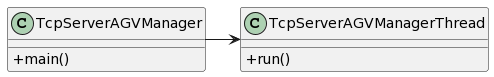

# US4003
=======================================

# 1. Requisitos

**As Project Manager, I want the communications (of the AGVManager) made through the SPOMS2022 protocol to be secured/protected.**

It should be adopted SSL/TLS with mutual authentication based on public key certificates.
It complements the US4001.

# 2. Análise

A US deve ser demonstrável.

É necessário integrar esta US com a US de SCOMP, realizada em C, cuja informação é obtida através de sockets.

**Dependência(s)**

Todas as US que necessitam de informação relacionada a agvs.

**Fluxo Básico**

- 1. O server é ligado.

- 2. O server recebe requests do AGV ou do Backoffice.

- 3. O server responde.

# 3. Design 

## 3.1. Realização da Funcionalidade

## 3.2. Diagrama de Classes

# 4. Implementação

    class TcpServerAGVManager {

    private static final int PORT_NUMBER = 2020;
    private static final String TRUSTED_STORE = "B.jks";
    private static final String KEYSTORE_PASS = "secret";

    public static void main(String[] args) throws Exception {
        SSLServerSocket sock = null;
        SSLSocket cliSock;

        System.setProperty("javax.net.ssl.trustStore", TRUSTED_STORE);
        System.setProperty("javax.net.ssl.trustStorePassword", KEYSTORE_PASS);

        System.setProperty("javax.net.ssl.keyStore", TRUSTED_STORE);
        System.setProperty("javax.net.ssl.keyStorePassword", KEYSTORE_PASS);

        SSLServerSocketFactory sslF = (SSLServerSocketFactory) SSLServerSocketFactory.getDefault();

        try {
            sock = (SSLServerSocket) sslF.createServerSocket(PORT_NUMBER);
            sock.setNeedClientAuth(true);
        } catch (IOException ex) {
            System.out.println("Failed to open server socket");
            System.exit(1);
        }
        System.out.println("Server side: Waiting for requests");
        while (true) {
            cliSock = (SSLSocket) sock.accept();
            new Thread(new TcpServerAGVManagerThread(cliSock)).start();
        }
    }

    static class TcpServerAGVManagerThread implements Runnable {

        private final SSLSocket s;
        private ObjectOutputStream sOut;
        private ObjectInputStream sIn;
        private DataOutputStream dOut;
        private DataInputStream dIn;
        static int[] positions = new int[1000];
        static int inc = 0;

        private AGVRepository agvRepository= PersistenceContext.repositories().agvs();
        private static WarehouseRepository wr = PersistenceContext.repositories().warehouse();
        private OrderRepository orderRepository=PersistenceContext.repositories().orders();

        public TcpServerAGVManagerThread(Socket cli_s) {
            s = (SSLSocket) cli_s;
        }

        public void run() {
            InetAddress clientIP;

            clientIP = s.getInetAddress();
            System.out.println("New client connection from " + clientIP.getHostAddress() +
                    ", port number " + s.getPort());
            int format = 0;
            int code = 0;
            try {
                try {
                    format = 1;
                    sOut = new ObjectOutputStream(s.getOutputStream());
                    sOut.flush();
                    sIn = new ObjectInputStream(s.getInputStream());
                } catch (StreamCorruptedException e) {
                    format = 2;
                    dOut = new DataOutputStream(s.getOutputStream());
                    dOut.flush();
                    dIn = new DataInputStream(s.getInputStream());
                    code = dIn.readByte();
                }

                if (format == 2) {

                    if (code == 1) {
                        WarehouseInfo wi = new WarehouseInfo();
                        warehousePlant = wi.warehouseC();
                        for (int i = 0; i < 18; i++) {
                            for (int j = 0; j < 20; j++) {
                                dOut.writeByte(warehousePlant[i][j]);
                                dOut.flush();
                            }
                        }
                        dOut.close();
                        dIn.close();
                    }
                    if (code == 2) {
                        positions[0] = 7; positions[1] = 4; positions[2] = 7; positions[3] =4;
                        positions[4] = 6;  positions[5] = 5;  positions[6] = 6;  positions[7] = 5;
                        for (int i = inc; i < 4+inc; i++) {
                            dOut.writeByte(positions[i]);
                            dOut.flush();
                        }
                        dOut.close();
                        dIn.close();
                        inc = inc + 4;
                    }
                    if (code !=1 && code != 2){
                        WarehouseInfo wi = new WarehouseInfo();
                        Integer[][] wp = new Integer[18][20];
                        for (int i = 0; i < 18; i++) {
                            for (int j = 0; j < 20; j++) {
                                wp[i][j] = z4;
                            }
                        }
                        w.warehouse(Arrays.deepToString(wp));
                        wr.save(w);
                        dOut.close();
                        dIn.close();

                    }
                }

                if (format ==  1) {
                    while (true) {
                        Packet packet = null;
                        try {
                            packet = (Packet) sIn.readObject();
                        } catch (ClassNotFoundException e) {
                            e.printStackTrace();
                        }

                        Packet packetWrite = new Packet((byte) 0, (byte) 2, "Acknowledged".getBytes(StandardCharsets.UTF_8));

                        switch (packet.getCode()) {
                            case 0:
                                System.out.println("==> Request to test the connection sent by Client received with success");
                                //Dizer ao cliente que entendeu
                                System.out.println("==> Send message to the client saying it understood the request");
                                sOut.writeObject(packetWrite);
                                sOut.flush();
                                break;
                            case 1:
                                try {
                                    System.out.println("==> Request to end connection sent by Client received with success");
                                    //Dizer ao cliente que entendeu
                                    System.out.println("==> Send message to the client saying it understood the request");
                                    sOut.writeObject(packetWrite);
                                    sOut.flush();
                                    System.out.println("==> Client " + clientIP.getHostAddress() + ", port number: " + this.s.getPort() + " disconnected");
                                } catch (IOException e) {
                                    System.out.println("==> ERROR: " + e.getMessage());
                                } finally {
                                    try {
                                        this.s.close();
                                    } catch (IOException e) {
                                        System.out.println("ERROR: Error while closing the socket");
                                    }
                                    System.out.println("==> INFO: Socket closed with Success\n\n");
                                }
                                break;
                            case 3:
                                System.out.println("==> Request to change the state of the AGV sent by digital twin client received with success");
                                Optional<AGV> agv = agvRepository.findById(idPacketParser(packet));
                                agv.get().setAgvState(statePacketParser(packet));
                                System.out.println("identidade:" + agv.get().identity());
                                System.out.println("state=" + statePacketParser(packet).toString());
                                agvRepository.save(agv.get());

                                if (statePacketParser(packet) == AGVState.OCCUPIED_SERVING_A_GIVEN_ORDER) {
                                    Iterable<ProductOrder> orderList = orderRepository.findByDateAscAndState(OrderState.TO_BE_PREPARED);
                                    if (orderList.iterator().hasNext()) {
                                        ProductOrder order = orderList.iterator().next();
                                        order.setOrderState(OrderState.BEING_PREPARED);
                                        orderRepository.save(order);
                                    }

                                }
                                if (statePacketParser(packet) == AGVState.FREE) {
                                    Iterable<ProductOrder> orderList = orderRepository.findByDateAscAndState(OrderState.BEING_PREPARED);
                                    if (orderList.iterator().hasNext()) {
                                        ProductOrder order = orderList.iterator().next();
                                        order.setOrderState(OrderState.READY_FOR_CARRIER);
                                        orderRepository.save(order);

                                    }
                                }
                                Packet packet1 = new Packet((byte) 0, (byte) 4, "Work".getBytes(StandardCharsets.UTF_8));
                                sOut.writeObject(packet1);
                                sOut.flush();
                                System.out.println("==> Send message to the client saying it has to work");

                                break;

                            case 5:
                                System.out.println("Received request of the state of the agv");
                                Optional<AGV> agvCase5 = agvRepository.findById(Long.parseLong(packet.data()));
                                Packet packetStatus = new Packet((byte) 0, (byte) 6, agvCase5.get().agvState().toString().getBytes());
                                sOut.writeObject(packetStatus);
                                sOut.flush();
                                break;
                            default:
                                System.out.println("==> ERROR: Error while sending the packet to the client");
                                break;

                        }

                    }
                }

            } catch (IOException ex) {
            }

        }

        public  Long idPacketParser(Packet packet){
            if (packet.getCode()!=3&& packet.getCode()!=5){
                return null;
            }
            String str= packet.data();
            long num=-1;
            for(int i=0;i<str.length();i++){
                if (str.substring(i,i+3).equals("ID:")){
                    num =Long.parseLong(str.substring(i+3));
                    break;
                }
            }
            return  num;
        }
        public AGVState statePacketParser(Packet packet) {
            if (packet.getCode()!=3 && packet.getCode() != 5){
                return null;
            }
            String str= packet.data();
            if (str.contains(AGVState.FREE.toString())){
                return AGVState.FREE;
            }
            if (str.contains(AGVState.OCCUPIED_SERVING_A_GIVEN_ORDER.toString())){
                return AGVState.OCCUPIED_SERVING_A_GIVEN_ORDER;
            }
            return null;
            }
        }

   

# 5. Integração/Demonstração

- US 2006 (principal) e outras.

