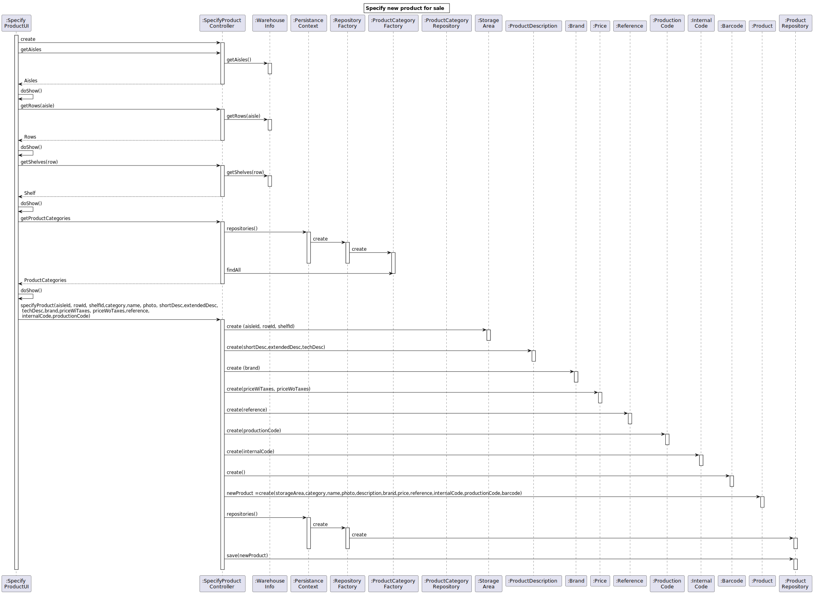
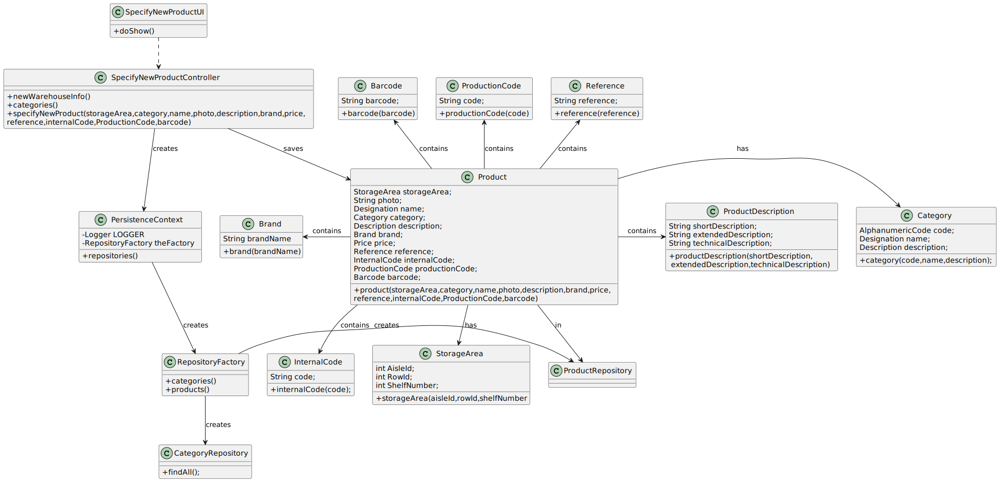

# US1001
=======================================

# 1. Requisitos

**As Sales Clerk, I want to specify a new product for sale.**

# 2. Análise

Produto é um elemento fulcral de todo o sistema e tem relações com armazéns, categorias e cátalogo.

É necessário implementar potenciais características que definem um produto (p.e. barcode, reference).

**Dependência(s)**

* Cada produto pertence obrigatoriamente a uma categoria, logo é necessário estas existirem à priori [US1005].

* Cada produto tem uma localização na warehouse, então este tem de estar configurado no sistema à priori.

**Fluxo Básico**

- 1. Sales Clerk inicia a especificação de um novo produto.

- 2. Insere ou seleciona as suas características.

- 3. Sistema valida os dados necessários e regista-os, informando o sucesso da operação.

**Esclarecimento(s) do Cliente Relevante(s)**

**1. ** Product Registration 

Some information regarding each of those (product) attributes:

- photo: it might be of any common format (e.g. png, jpeg, svg);

- short description: not empty having 30 chars maximum;

- extended description: not empty with a minimum of 20 chars and 100 chars maximum;

- technical description: multiple lines of text, preferably with no limit or the biggest possible.

- brand: not empty having 50 chars maximum;

- reference: not empty alphanumeric code with at 23 chars maximum;

- production code: not empty alphanumeric code with at 23 chars maximum however it might meet a given regular expression defined/configured at deployment time.

- internal code: not empty alphanumeric code with at 23 chars maximum however it might meet a given regular expression defined/configured at deployment time.

Mandatory attributes: internal code, short and extended description.

In accordance with the specification document, other atributes might also be mandatory.

**2. ** Currency

- The project must be prepared to easily support several currencies.

- The system should work adopting a base currency (e.g.: EUR) and, according to the customer location, be able to present prices on other currencies (e.g. USD) using an external currency converter.

- During the prototype development, using a currency converter should not be a major concern.

The system adopts a base currency (EUR). If needed, a converter will be implemented.

**3. ** Barcode

- Barcodes are manually introduced by users since each product barcode is provided by the product manufacture.

**4. ** Product vs Category

- By simplicity, a category consists only of an alphanumeric code, and a description. Each product belongs mandatorily to a single category.
 
- As so, and contrary to what is suggested in your question, there is no hierarchy between categories.

**5. ** Product Location

- The products’ location in the warehouse, which corresponds to a storage area i.e., the aisle identifier, the row identifier, and the shelf identifier. All these identifiers are numeric. Products with an unknown location cannot the ordered.

# 3. Design

## 3.1. Realização da Funcionalidade

## 3.2. Diagrama de Classes

## 3.3. Padrões Aplicados

- GRASP
- JPA
- Repository 

## 3.4. Testes 

	@Test(expected = IllegalArgumentException.class)
    public void ensureNullIsNotAllowed() {
        new Product(null, null,null, null,null, null, null, null, null, null, null);
    }

    @Test
    public void product() {
        new Product(STORAGEAREA,CATEGORY,DESIGNATION,PHOTO,DESCRIPTION,BRAND,PRICE,REFERENCE,INTERNAL_CODE,PRODUCTION_CODE,BARCODE);
        assertTrue(true);
    }

    @Test(expected = IllegalArgumentException.class)
    public void ensureProductMustHavePrice() {
        new Product(STORAGEAREA,CATEGORY,DESIGNATION,PHOTO,DESCRIPTION,BRAND,null,REFERENCE,INTERNAL_CODE,PRODUCTION_CODE,BARCODE);
    }

    @Test(expected = IllegalArgumentException.class)
    public void ensureProductMustHaveCategory() {
        new Product(STORAGEAREA,null,DESIGNATION,PHOTO,DESCRIPTION,BRAND,PRICE,REFERENCE,INTERNAL_CODE,PRODUCTION_CODE,BARCODE);
    }

    @Test(expected = IllegalArgumentException.class)
    public void ensureProductMustHaveInternalCode() {
        new Product(STORAGEAREA,CATEGORY,DESIGNATION,PHOTO,DESCRIPTION,BRAND,PRICE,REFERENCE,null,PRODUCTION_CODE,BARCODE);
    }

    @Test(expected = IllegalArgumentException.class)
    public void ensureProductMustHaveBrand() {
        new Product(STORAGEAREA,CATEGORY,DESIGNATION,PHOTO,DESCRIPTION,null,PRICE,REFERENCE,INTERNAL_CODE,PRODUCTION_CODE,BARCODE);
    }

    @Test(expected = IllegalArgumentException.class)
    public void ensureProductMustHaveName() {
        new Product(STORAGEAREA,CATEGORY,Designation.valueOf(" "),PHOTO,DESCRIPTION,BRAND,PRICE,REFERENCE,INTERNAL_CODE,PRODUCTION_CODE,BARCODE);
        new Product(STORAGEAREA,CATEGORY,null,PHOTO,DESCRIPTION,BRAND,PRICE,REFERENCE,INTERNAL_CODE,PRODUCTION_CODE,BARCODE);
    }

    @Test(expected = IllegalArgumentException.class)
    public void ensureProductMustHaveBarcode() {
        new Product(STORAGEAREA,CATEGORY,DESIGNATION,PHOTO,DESCRIPTION,BRAND,PRICE,REFERENCE,INTERNAL_CODE,PRODUCTION_CODE,null);
    }

    @Test
    public void ensureProductIsTheSameAsItsInstance() {
        Product p =new Product(STORAGEAREA,CATEGORY,DESIGNATION,PHOTO,DESCRIPTION,BRAND,PRICE,REFERENCE,INTERNAL_CODE,PRODUCTION_CODE,BARCODE);
        final boolean expected = p.sameAs(p);
        assertTrue(expected);
    }

# 4. Implementação

## Construtor do Produto
    public Product(StorageArea storageArea, Category category,Designation name, String photoPath, ProductDescription description, Brand brand,
                    Price price,Reference reference, InternalCode internalCode, ProductionCode productionCode, Barcode barcode) {
        Preconditions.noneNull(category,name,photoPath,brand,price,internalCode,barcode);
        this.storageArea = storageArea;
        this.category = category;
        this.name = name;
        this.photoPath = photoPath;
        this.description = description;
        this.brand = brand;
        this.price = price;
        this.reference = reference;
        this.internalCode = internalCode;
        this.productionCode = productionCode;
        this.barcode = barcode;
        this.active = true;
    }

## SpecifyNewProductUI 

    public class SpecifyNewProductUI extends AbstractUI {

    private final SpecifyNewProductController theController = new SpecifyNewProductController();

    @Override
    protected boolean doShow() {

        final Iterable<Category> productCategories = this.theController.categories();

        final SelectWidget<Category> selector = new SelectWidget<>("Product Categories:", productCategories,
                new ProductCategoryPrinter());
        selector.show();
        final Category theProductCategory = selector.selectedElement();

        String name;
        do {
            name = Console.readLine("Name");
            if (name.isEmpty()) {
                System.out.println("This field can't be empty.");
            }
        } while (name.isEmpty());

        (...)

        Double priceWoTaxes = Console.readDouble("Price without Taxes €");
        Double priceWiTaxes = Console.readDouble("Price with Taxes €");

        (...)

        theController.specifyNewProduct(theProductCategory,storageArea,Designation.valueOf(name),photoPath,new ProductDescription(shortDescription,
                extendedDescription, techDescription), new Brand(brand),new Price(priceWoTaxes, priceWiTaxes),
                new Reference(reference), new InternalCode(internalCode), new ProductionCode(productionCode),
                new Barcode(barcode));

        return true;
        }

    @Override
    public String headline() {
        return "Specify New Product";
        }
    }

##SpecifyNewProductController

    public class SpecifyNewProductController {

    private final ProductRepository productRepository = PersistenceContext.repositories().products();
    private final ListCategories svcCategories = new ListCategories();

    public Product specifyNewProduct (Category category,StorageArea storageArea,Designation name, String photoPath, ProductDescription description, Brand brand,
                                      Price price, Reference reference, InternalCode internalCode, ProductionCode productionCode, Barcode barcode) {
        return productRepository.save(new Product(storageArea,category,name,photoPath,description,brand,price,reference,internalCode,productionCode,barcode));
    }

    public Iterable<Category> categories () {
        return svcCategories.allCategories();
    }

- Issue #10

# 5. Integração/Demonstração

- Foi adicionada uma opção (Products -> Specify New Product) ao menu do SalesClerk.
 
- A categoria (do produto) é selecionada apartir da escolha de uma entre as já existentes.

- Devem ser inseridas as informações do produto, tendo o sistema verificações de forma a cumprir os requisitos fornecidos pelo cliente.

# 6. Observações

