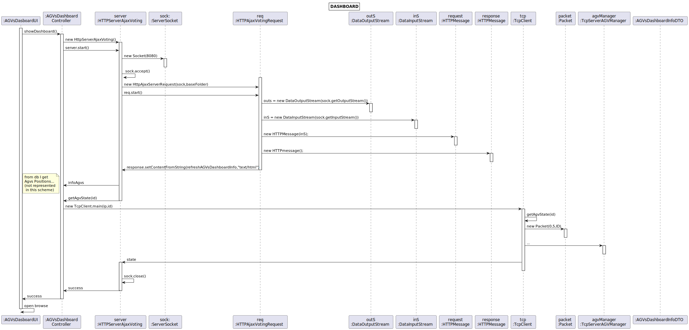
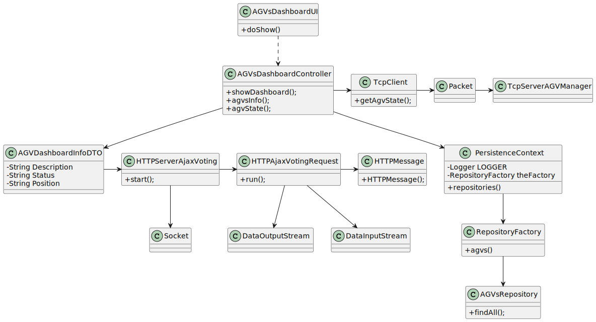

# US2005
=======================================


# 1. Requisitos

**As Warehouse Employee, I want to open a web dashboard presenting the current status of the AGVs as well as their position in the warehouse layout and keeps updated automatically (e.g.: at each minute).**

* It must be used the provided application protocol (SPOMS2022). The dashboard is intended to be displayed on a web page provided by an existing HTTP server in the "BackOfficeApp" application and only available to localhost. The dashboard web page is kept updated without reloading.

# 2. Análise

É necessário obter a informação dos AGVs (description,status e posição) usando o protocolo fornecido.

A Dashboard tem de se manter atualizada sem dar reload.

A posição é obtida através da localização do produto de uma order atribuída a um dado AGV.

# 2. Implementação

Para receber a informação disponibilizada pelo BackOfficeApp server esta funcionalidade utiliza sockets.

Assim, é feito um request ao referido servidor sempre que é necessária uma atualização.

Para concretizar a atualização o servidor HTML ,implementado em java, depois de receber os dados, manipula-os de modo a representar a informação de forma correta na dashboard.

Uma função em JavaScript assegura que a informação é atualizada.

# 3. Design
## 3.1. Realização da Funcionalidade



## 3.2. Diagrama de Classes



## 3.3. Padrões Aplicados

- GRASP
- JPA
- Repository


# 4. Integração/Demonstração

Para o servidor HTTP utilizamos a porta 8080 em localhost.

```
function refreshAGVsDashboardInfo() {
    var request = new XMLHttpRequest();
    var vBoard=document.getElementById("agvsDashboard");

    request.onload = function() {
        vBoard.innerHTML = this.responseText;
        vBoard.style.color="white";
        setTimeout(refreshAGVsDashboardInfo, 2000);
    };

    request.ontimeout = function() {
        vBoard.innerHTML = "Server timeout, still trying ...";
        vBoard.style.color="red";
        setTimeout(refreshAGVsDashboardInfo, 2000);
    };

    request.onerror = function() {
        vBoard.innerHTML = "No server reply, still trying ...";
        vBoard.style.color="red";
        setTimeout(refreshAGVsDashboardInfo, 2000);
    };

    request.open("GET", "/agvsDashboard", true);
    request.timeout = 2000;
    request.send();
}

function refreshPersonalInfo() {
    var request = new XMLHttpRequest();
    var vBoard=document.getElementById("personalInfo");

    request.onload = function() {
        vBoard.innerHTML = this.responseText;
        vBoard.style.color="white";
        setTimeout(refreshPersonalInfo, 2000);
    };

    request.ontimeout = function() {
        vBoard.innerHTML = "Server timeout, still trying ...";
        vBoard.style.color="red";
        setTimeout(refreshPersonalInfo, 2000);
    };

    request.onerror = function() {
        vBoard.innerHTML = "No server reply, still trying ...";
        vBoard.style.color="red";
        setTimeout(refreshPersonalInfo, 2000);
    };

    request.open("GET", "/personalInfo", true);
    request.timeout = 2000;
    request.send();
}

public static synchronized String getPersonalInfo () {
        return " <div class=\"topnav\" id=\"personalInformation\">\n" +
                "    <a class=\"active\" href=\"#home\">Personal Information</a>\n" +
                "    <a href=> Name: " + username + "</a>\n" +
                "    <a href=> Email: " + email + "</a>\n" +
                "</div> ";
    }

    public static synchronized String refreshAGVsDashboardInfo() {
        try {
            AGVsDashboardController controller = new AGVsDashboardController();
            agvsDashboard = controller.infoAGVs();
            if (agvsDashboard != null) {
                StringBuilder s = new StringBuilder();
                for (AGVsDashboardInfoDTO agv : agvsDashboard) {
                    s.append("<tr class=\"active-row\">" +
                            "<td>" + agv.AGVDescription + "</td>" +
                            "<td>" + agv.AGVStatus + "</td>" +
                            "<td>" + agv.AGVPosition + "</td>" +
                            "</tr>");
                }
                return s.toString();
            } else {
                return " ";
            }
        } catch (NullPointerException ne) {
            return " ";
        }
    }
```  
Socket request
```

    public static void main(String[] args) throws Exception {

        System.out.println("Client side: Waiting for you to send a request");

        if (args.length != 1) {
            System.out.println("Server IPv4/IPv6 address or DNS name is required as argument");
            System.exit(1);
        }

        try {
            serverIP = InetAddress.getByName(args[0]);
        } catch (UnknownHostException ex) {
            System.out.println("Invalid server specified: " + args[0]);
            System.exit(1);
        }

        try {
            sock = new Socket(serverIP, PORT_NUMBER);
        } catch (IOException ex) {
            System.out.println("Failed to establish TCP connection");
            System.exit(1);
        }

        BufferedReader in = new BufferedReader(new InputStreamReader(System.in));
        ObjectOutputStream outputStream = new ObjectOutputStream(sock.getOutputStream());
        ObjectInputStream inputStream = new ObjectInputStream(sock.getInputStream());

        String conteudo = "";

        byte version = 0, code = 3;

        do {
            conteudo = in.readLine();
            //Packet packet = new Packet(version, code, conteudo.getBytes(StandardCharsets.UTF_8));
            Packet packetOccupied = getAvgState(Long.valueOf(36));
            outputStream.writeObject(packetOccupied);
            System.out.println("sent packet with data " + packetOccupied.data());
            Packet packetReceived = (Packet) inputStream.readObject();
            if (packetReceived.getCode() == 2 && packetReceived.getCode() == 1) {
                break;
            }

            System.out.println("received packet with data " + packetReceived.data());
            Packet packetFree = getAvgState(Long.valueOf(36));

            if (packetReceived.getCode() == 5) {
                Thread.sleep(10000); //simulates work
                System.out.println("Work has finished");
                outputStream.writeObject(packetFree);
            }

        }
        while (!conteudo.equals("-1"));
        sock.close();
    }

    private static Packet getAvgState(Long id){
        Packet packet= new Packet((byte) 0,(byte) 5,("ID:"+id).getBytes(StandardCharsets.UTF_8));
        return packet;
    }

```  
UI
```
    protected boolean doShow() {

        CTRL.showDashboard();

        URI uri;
        try {
            uri = new URI("http://localhost:8080/"); 
            Desktop.getDesktop().browse(uri);
        } catch (URISyntaxException | IOException e) {
            e.printStackTrace();
            return false;
        }
        return true;
    }
```     
    
# 5. Observações


