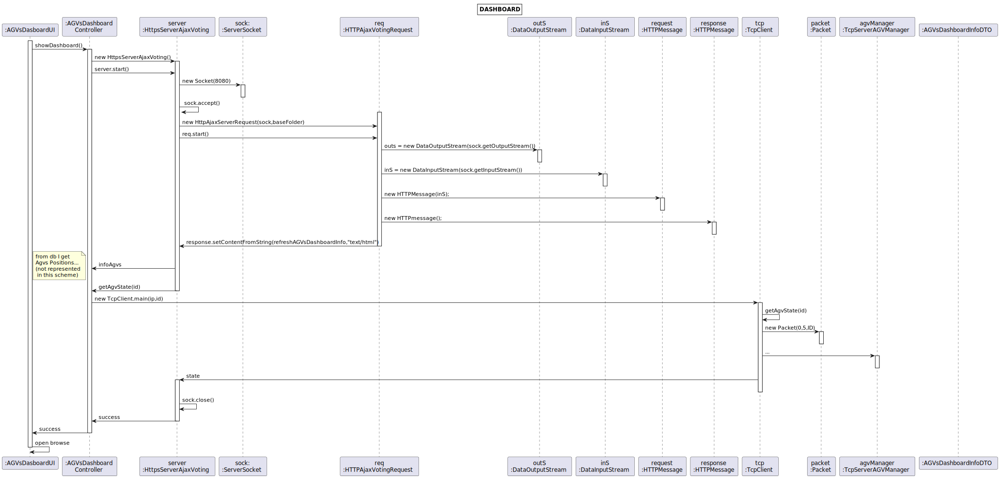
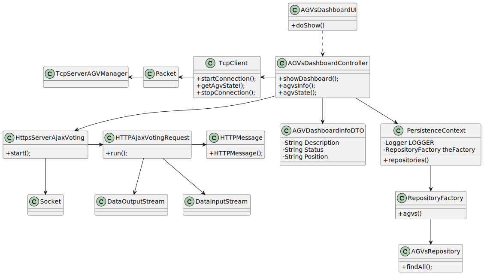

# US2006
=======================================


# 1. Requisitos

**As Project Manager, I want the communications made through the SPOMS2022 protocol to be secured/protected.**

* It should be adopted SSL/TLS with mutual authentication based on public key certificates. It complements the US2005.

# 2. Análise

É necessário obter a informação dos AGVs (description,status e posição) usando o protocolo fornecido.

A Dashboard tem de se manter atualizada sem dar reload.

No Sprint 3 não tivemos muita informação sobre a localização dos AGVs, pelo que assumi que o estado Free se traduzia em ter o AGV na dock e o estado Occupied correspondia a ter os AGVs na localização dos produtos de uma dada order.

# 2. Implementação

Para receber a informação disponibilizada pelo BackOfficeApp server esta funcionalidade utiliza sockets.

Assim, é feito um request ao referido servidor sempre que é necessária uma atualização.

Para concretizar a atualização o servidor HTML ,implementado em java, depois de receber os dados, manipula-os de modo a representar a informação de forma correta na dashboard.

Uma função em JavaScript assegura que a informação é atualizada.

# 3. Design
## 3.1. Realização da Funcionalidade



## 3.2. Diagrama de Classes



## 3.3. Padrões Aplicados

- GRASP
  * Controller - AGVsDashboardInfoController, que tem a responsabilidade de gerir a informação/eventos desta US.
  * Low Coupling & High Cohesion - AGVsDashboardInfoDTO, sem comportamento, apenas obtém a informação a mostrar na Dashboard.
  
# 4. Integração/Demonstração

```
function refreshAGVsDashboardInfo() {
    var request = new XMLHttpRequest();
    var vBoard=document.getElementById("agvsDashboard");

    request.onload = function() {
        vBoard.innerHTML = this.responseText;
        vBoard.style.color="white";
        setTimeout(refreshAGVsDashboardInfo, 2000);
    };

    request.ontimeout = function() {
        vBoard.innerHTML = "Server timeout, still trying ...";
        vBoard.style.color="red";
        setTimeout(refreshAGVsDashboardInfo, 2000);
    };

    request.onerror = function() {
        vBoard.innerHTML = "No server reply, still trying ...";
        vBoard.style.color="red";
        setTimeout(refreshAGVsDashboardInfo, 2000);
    };

    request.open("GET", "/agvsDashboard", true);
    request.timeout = 2000;
    request.send();
}

function refreshPersonalInfo() {
    var request = new XMLHttpRequest();
    var vBoard=document.getElementById("personalInfo");

    request.onload = function() {
        vBoard.innerHTML = this.responseText;
        vBoard.style.color="white";
        setTimeout(refreshPersonalInfo, 2000);
    };

    request.ontimeout = function() {
        vBoard.innerHTML = "Server timeout, still trying ...";
        vBoard.style.color="red";
        setTimeout(refreshPersonalInfo, 2000);
    };

    request.onerror = function() {
        vBoard.innerHTML = "No server reply, still trying ...";
        vBoard.style.color="red";
        setTimeout(refreshPersonalInfo, 2000);
    };

    request.open("GET", "/personalInfo", true);
    request.timeout = 2000;
    request.send();
}

public static synchronized String getPersonalInfo () {
        return " <div class=\"topnav\" id=\"personalInformation\">\n" +
                "    <a class=\"active\" href=\"#home\">Personal Information</a>\n" +
                "    <a href=> Name: " + username + "</a>\n" +
                "    <a href=> Email: " + email + "</a>\n" +
                "</div> ";
    }

    public static synchronized String refreshAGVsDashboardInfo() {
        try {
            AGVsDashboardController controller = new AGVsDashboardController();
            agvsDashboard = controller.infoAGVs();
            if (agvsDashboard != null) {
                StringBuilder s = new StringBuilder();
                for (AGVsDashboardInfoDTO agv : agvsDashboard) {
                    s.append("<tr class=\"active-row\">" +
                            "<td>" + agv.AGVDescription + "</td>" +
                            "<td>" + agv.AGVStatus + "</td>" +
                            "<td>" + agv.AGVPosition + "</td>" +
                            "</tr>");
                }
                return s.toString();
            } else {
                return " ";
            }
        } catch (NullPointerException ne) {
            return " ";
        }
    }
```  
HttpServerAjaxVoting thread
```
 @Override
    public void run() {
        SSLSocket cliSock = null;

        System.setProperty("javax.net.ssl.keyStore", "serverHTTP.jks");
        System.setProperty("javax.net.ssl.keyStorePassword", "forgotten");

        try {
            SSLServerSocketFactory sslF = (SSLServerSocketFactory) SSLServerSocketFactory.getDefault();
            sock = (SSLServerSocket) sslF.createServerSocket(11555);
        } catch (IOException ex) {
            System.out.println("Server failed to open local port " + 11555);
            System.exit(1);
        }

        while (true) {
            try {
                cliSock = (SSLSocket) sock.accept();
            } catch (IOException e) {
                e.printStackTrace();
            }
            HttpAjaxVotingRequest req = new HttpAjaxVotingRequest(cliSock, BASE_FOLDER);
            req.start();
        }

    }

```  
UI
```
    protected boolean doShow() {

        CTRL.showDashboard();

        URI uri;
        try {
            uri = new URI("https://localhost:11555/"); 
            Desktop.getDesktop().browse(uri);
        } catch (URISyntaxException | IOException e) {
            e.printStackTrace();
            return false;
        }
        return true;
    }
```     
    
# 5. Observações


