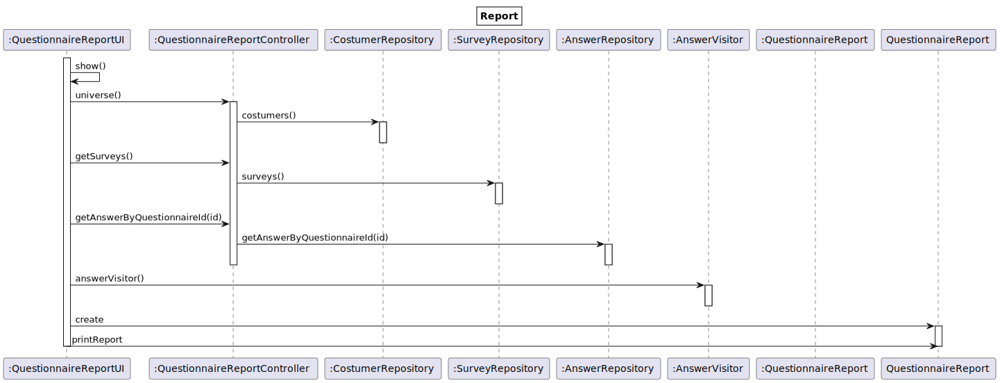
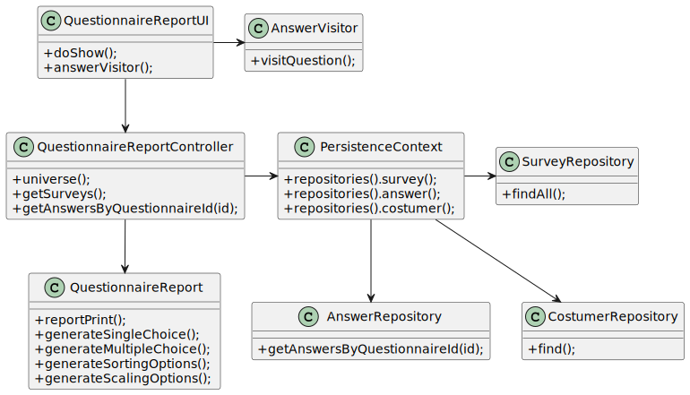

# US3002
=======================================

# 1. Requisitos

**As Sales Manager, I want to get a statistical report regarding a previously set up questionnaire.**

* Again, notice that the report should be generated considering the given questionnaire and the set of answers obtained until the current moment.

# 2. Análise

É necessário obter as repostas dos clientes a um dado questionário, analisar com a gramática para assim gerar o relatório.

# 2. Implementação

Plano : Survey - Universe - Questionnaire - AnswerVisitor - Report

# 3. Design
## 3.1. Realização da Funcionalidade

## 3.2. Diagrama de Classes

## 3.3. Padrões Aplicados

- GRASP
  * Controller - QuestionnaireReportController, que tem a responsabilidade de gerir a informação/eventos desta US.
  
# 4. Integração/Demonstração

Controller

    public class QuestionnaireReportController {

    private final SurveyRepository surveyRepository = PersistenceContext.repositories().surveys();
    private final AnswerRepository answerRepository = PersistenceContext.repositories().answers();

    public Iterable <Survey> getSurveys () {
        return surveyRepository.findAll();
    }

    public Iterable <Answer> getAnswersByQuestionnaireId (AlphaNumericCode id) {
        return answerRepository.getAnswersByQuestionnaireId (id);
    }

    public List <Integer> universe () {
        List <Integer> universe = new ArrayList<>();
        List <String> aux = new ArrayList<>();
        List <Answer> answerList = (List<Answer>) answerRepository.findAll();
        for (Answer a : answerList) {
            if (!aux.contains(a.getCustomer().toString())) {
                aux.add(a.getCustomer().toString());
            }
        }
        universe.add(aux.size());
        universe.add((int)PersistenceContext.repositories().customers().size());
        return universe;
    }
    }

UI

     final Iterable <Survey> surveys = controller.getSurveys();
        final SelectWidget<Survey> selector = new SelectWidget<>("Surveys:", surveys,
                new SurveyPrinter());
        selector.show();
        Survey selectSurvey = selector.selectedElement();
        List<Answer> answers = (List<Answer>) controller.getAnswersByQuestionnaireId(selectSurvey.alphaNumericCode());
        FileInputStream fis = null;
        try {
            fis = new FileInputStream("base.core/src/main/java/eapli/base/grammar/teste.txt");
        } catch (FileNotFoundException e) {
            e.printStackTrace();
        }
        LabeledExprLexer lexer = null;
        try {
            lexer = new LabeledExprLexer(new ANTLRInputStream(fis));
        } catch (IOException e) {
            e.printStackTrace();
        }
        CommonTokenStream tokens = new CommonTokenStream(lexer);
        LabeledExprParser parser = new LabeledExprParser(tokens);
        ParseTree tree = parser.prog();
        AnswerVisitor eval = new AnswerVisitor();
        eval.questionnaireAnswers(answers);
        eval.visit(tree);

        List <Integer> universe = controller.universe();

        QuestionnaireReport qr = new QuestionnaireReport(universe.get(0),universe.get(1),eval.singleChoice(),eval.multipleChoice(),eval.sortingOptions(),eval.scalingOptions());
        System.out.println(qr.reportPrint());

        return false;
    }

Questionnaire Report

    public class QuestionnaireReport {

    private final Integer universe;
    private final Integer totalAnswers;
    private final Long answersPer100;
    private final Map<String,List<List<String>>> singleChoice;
    private final Map<List<String>,List<List<String>>> multipleChoice;
    private final Map<List<String>,List<List<String>>> sortingOptions;
    private final Map<List<String>,List<List<String>>> scalingOptions;
    DecimalFormat decimalFormat = new DecimalFormat("#.##");

    public QuestionnaireReport (Integer universe,Integer answersPer100,Map<String, List<List<String>>> singleChoice, Map<List<String>,
            List<List<String>>> multipleChoice, Map<List<String>, List<List<String>>> sortingOptions,
            Map<List<String>, List<List<String>>> scalingOptions) {
        this.answersPer100 = Long.valueOf(answersPer100);
        this.universe = universe;
        this.singleChoice = singleChoice;
        this.multipleChoice = multipleChoice;
        this.sortingOptions = sortingOptions;
        this.scalingOptions = scalingOptions;
        this.totalAnswers = singleChoice.entrySet().size() + multipleChoice.entrySet().size()
                + sortingOptions.entrySet().size() + scalingOptions.entrySet().size();
    }
    public String reportPrint () {
        return "Universe: " + universe +
                "\nCostumers Answers: " + universe + " of " + answersPer100 + " possible"+
                "\nTotal Questions Answered: " + totalAnswers +
                "\n-----------------------\nSingle Choice\n\n" + generateSingleChoiceReport() +
                "\n-----------------------\nMultiple Choice\n\n" + generateMultipleChoiceReport() +
                "\n-----------------------\nSorting Options\n\n" + sortingOptions +
                "\n-----------------------\nScaling Options\n\n" + generateScalingOptionsReport();
    }
    ...
    }
    
# 5. Observações

