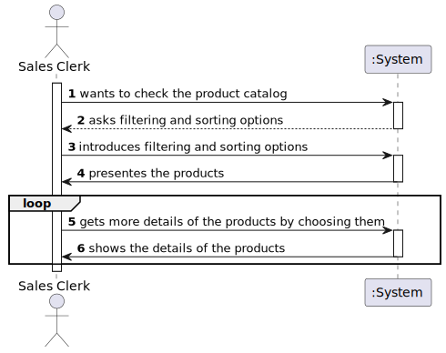
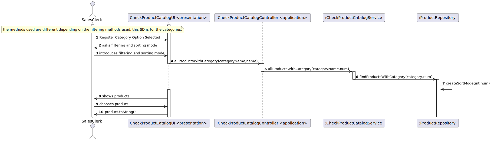
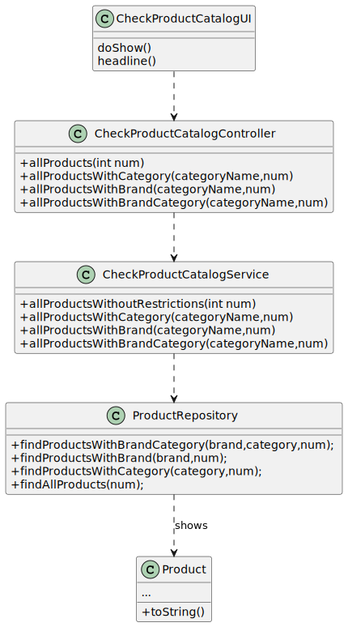

# US1002
=======================================

# 1. Requisitos

**As Sales Clerk, I want to view/search the products catalog.**

O catálogo serve para procurar produtos e ver detalhes sobre os mesmos, além disso tem elementos para otimizar essa pesquisa

# 2. Análise

O cátalogo terá maneiras de filtrar(categoria,marca,descrição) e de ordenar (por preço,ou ordem alfabetica)

**Dependência(s)**

US1001(criação de produtos) e as suas dependências

**Fluxo Básico**

- 1. Sales Clerk escolhe a opção de ver o catálogo.

- 2. Escolhe as opções de filtragem e de ordenação.

- 3. Escolhe o(s) produto(s) que deseja ver.

**Esclarecimento(s) do Cliente**

**1.** Filter options

"Commonly fields used to filter products are:

Category
Description (any of the available descriptions)
Brand
User should select/specify a data presentation order. This applies to any similar US.

At least the product' code, short description, brand, category and unit price should be presented.

More details can be presented for a given/selected product at user request."

## 2.1 Futuras implementações para os outros atores

* Não existem.

## 2.2 Sequência das ações

* O sales clerk escolhe as opções e depois vê o produto que deseja.

## 2.3 Regras de negócio.

n/a.

## 2.4 Pré Condições

n/a.

## 2.5 Pós Condições

n/a.

## 2.6 SSD

# 3. Design

## 3.1. Realização da Funcionalidade

## 3.2. Diagrama de Classes

## 3.3. Padrões Aplicados

- GRASP
- JPA
- Repository

## 3.4. Testes

Os testes foram conduzidos através da utilização da aplicação com casos concretos. (eg. verificar que três produtos com preçõs diferentes ficam todos por ordem).

# 4. Implementação

**UI**

     @Override
    protected boolean doShow() {
        Scanner sc= new Scanner(System.in);
        int sort_mode=0;
        do {
            System.out.println("Please choose the sorting mode you wish to use:");
            System.out.println("1.No Sorting");
            System.out.println("2.Sort by Product name");
            System.out.println("3.Sort by Price");
        sort_mode=sc.nextInt();
        }while (!sortList.contains(sort_mode));

        if (this.mode == ALL_ITEMS_MODE) {

            Product selectedProduct = null;
            final Iterable<Product> allProducts = this.theController.allProducts(sort_mode);

            List<Product> productList = new ArrayList<>();
            for (Product product : allProducts) {

                    productList.add(product);

            }
            final SelectWidget<Product> selector = new SelectWidget<>("Products:", productList, new ProductPrinter());
            do {
                try {
                    selector.show();
                    selectedProduct = selector.selectedElement();
                    System.out.println(selectedProduct.toString());
                } catch (NullPointerException e) {
                    System.out.println("Exiting...");
                }

            } while (selectedProduct != null);
        }
        if (this.mode == CATEGORY_MODE) {
            System.out.println("Available Categories:");
            Iterable<Category> categories=theController.allCategories();
            for (Category category:categories ){
                System.out.println(category.toString());
            }
            final String category = Console.readLine("Please type the name of the category you wish to search:");
            Product selectedProduct = null;
            final Iterable<Product> allProductsWithCategory = this.theController.allProductsWithCategory(category,sort_mode);
            //sortList(productList,sort_mode);
            final SelectWidget<Product> selector = new SelectWidget<>("Products:", allProductsWithCategory, new ProductPrinter());
            do {
                try {
                    selector.show();
                    selectedProduct = selector.selectedElement();
                    System.out.println(selectedProduct.toString());
                } catch (NullPointerException e) {
                    System.out.println("Exiting...");
                }
            } while (selectedProduct != null);
        }
    ...

    (poderia ser melhor implementado com um switch case)

**Controller**

     public Iterable<Product> allProducts(int num) {return svc.allProductsWithoutRestrictions(num);}

    public Iterable<Product> allProductsWithCategory(String categoryName,int num){
        return svc.allProductsWithCategory(categoryName,num);
    }

    public Iterable<Product> allProductsWithBrand(String brandName,int num){
        return svc.allProductsWithBrand(brandName,num);
    }

    public Iterable<Product> allProductsWithBrandCategory(String brandName,String categoryName,int num){
        return svc.allProductsWithBrandCategory(brandName,categoryName,num);
    }
    public Iterable<Category> allCategories(){
        return svc.allCategories();
    }

    public Iterable<Brand> allBrands(){
        return svc.allBrands();
    }

**Service**

    public Iterable<Product> allProducts(){
        return productRepository.findAll();
    }
    public Iterable<Product> allProductsWithoutRestrictions(int num){
        return productRepository.findAllProducts(num);
    }

    public Iterable<Product> allProductsWithCategory(String category,int num){
        return productRepository.findProductsWithCategory(category,num);
    }

    public Iterable<Product> allProductsWithBrand(String brand,int num){
        return productRepository.findProductsWithBrand(brand,num);
    }
    public Iterable<Product> allProductsWithBrandCategory(String brand,String category,int num){
        return productRepository.findProductsWithBrandCategory(brand,category,num);
    }

    public Iterable<Category> allCategories(){
        return categoryRepository.findAll();
    }
    public Iterable<Brand> allBrands(){
        return productRepository.findAllBrands();
    }

**Repository**

    @Override
    public Iterable<Product> findAllProducts(int num){
        final TypedQuery<Product> query=entityManager().createQuery("SELECT p FROM Product p"+createSortMode(num),Product.class);
        return query.getResultList();
    }
    @Override
    public Iterable<Product> findProductsWithCategory(String categoryName,int num) {
        Designation categoryDesignation= Designation.valueOf(categoryName);
        final TypedQuery<Product> query = entityManager().createQuery("SELECT p FROM Product p JOIN p.category cat WHERE cat.name = :name"+createSortMode(num),Product.class);
        query.setParameter("name",categoryDesignation);
        return query.getResultList();

    }
    @Override
    public Iterable<Product> findProductsWithBrand(String brand,int num){
        Brand brandName= new Brand(brand);
        final TypedQuery<Product> query= entityManager().createQuery("SELECT p from Product  p WHERE p.brand = :brand "+createSortMode(num),Product.class);
        query.setParameter("brand",brandName);
        return query.getResultList();
    }

    @Override
    public Iterable<Product> findProductsWithShelveNumber(int aisleId, int rowId, int shelveNumber) {
        final TypedQuery<Product> query= entityManager().createQuery("SELECT p from Product  p WHERE p.storageArea.shelfNumber = :shelveNumber " +
                                                                        "AND  p.storageArea.aisleId = :aisleId AND p.storageArea.rowId = :rowId"
                                                                        ,Product.class);
        query.setParameter("aisleId",aisleId);
        query.setParameter("rowId",rowId);
        query.setParameter("shelveNumber",shelveNumber);
        return query.getResultList();
    }

    @Override
    public Iterable<Product> findProductsWithBrandCategory(String brand,String category,int num){
        Brand brandName= new Brand(brand);
        Designation categoryDesignation= Designation.valueOf(category);
        final TypedQuery<Product> query= entityManager().createQuery("SELECT p from Product  p JOIN p.category cat where  cat.name =:name AND p.brand = :brand "+createSortMode(num),Product.class);
        query.setParameter("name",categoryDesignation);
        query.setParameter("brand",brandName);
        return query.getResultList();
    }
    @Override
    public Iterable<Brand> findAllBrands(){
    final TypedQuery<Brand> query= entityManager().createQuery("select  DISTINCT p.brand from Product p",Brand.class);
    return query.getResultList();
    }

    @Override
    public String createSortMode(int num){
        if (num==NO_SORTING){
            return "";
        }
        if (num==SORT_BY_NAME){
            return " ORDER BY p.name";
        }
        if (num==SORT_BY_PRICE){
            return " ORDER BY p.price";
        }
        return null;
    }

# 5. Integração/Demonstração

- Foi adicionada uma opção (Product Catalog -> Check Product Catalog) ao menu do SalesClerk.

- O catalog permite ver varios produtos sem ter de escolher a opção multiplas vezes
# 6. Observações

- Existe elevada duplicação no UI 

- O sorting só pode ser feito antes da demostração dos produtos.

