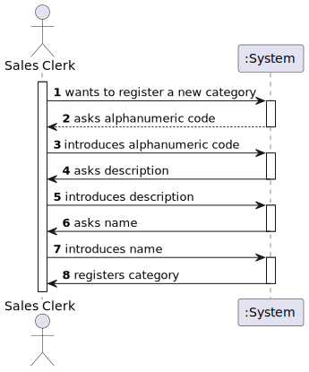
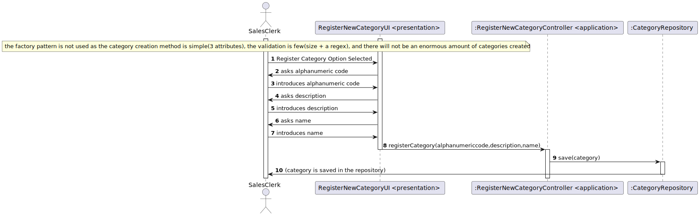
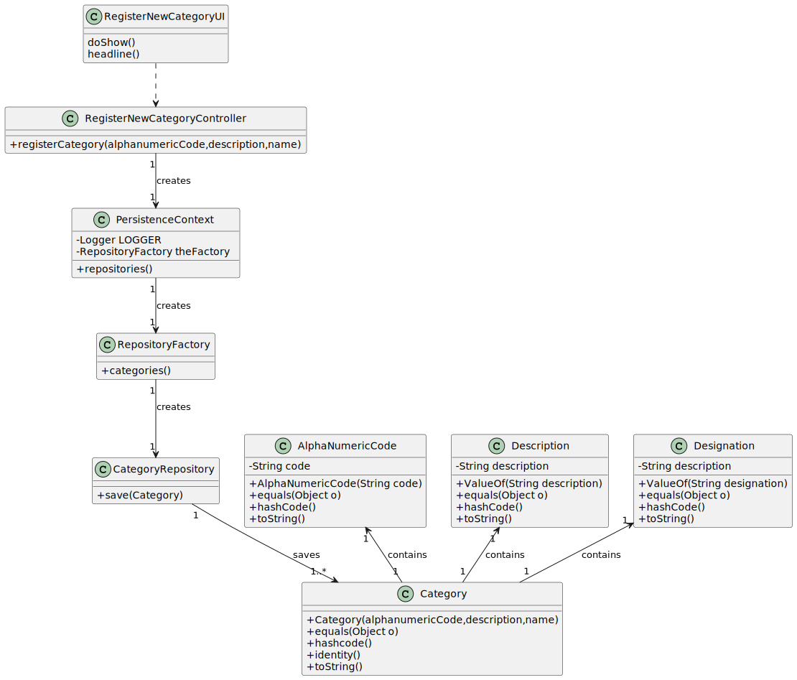

# US1005
=======================================

# 1. Requisitos

**As Sales Clerk, I want to define a new category of products.**

A categoria serve para ajudar na definição de produtos e para fornecer ao ao utilizador uma melhor maneira de pesquisar o que ele deseja comprar.

O registo vai ser feito através da consola

# 2. Análise

Categoria é necessária para otimizar o catálogo e a pesquisa nesse mesmo.

Caracterizada por um código alfanumérico,uma descrição e um nome. 

**Dependência(s)**

Não existem para esta US.

**Fluxo Básico**

- 1. Sales Clerk inicia a especificação de uma nova categoria.

- 2. Insere ou seleciona as suas características.

- 3. Sistema valida os dados necessários e regista-os, informando o sucesso da operação.

**Esclarecimento(s) do Cliente**

**1.** Category constitution

"By simplicity, a category consists only of an alphanumeric code, and a description. Each product belongs mandatorily to a single category."

"There are some basic rules:

- code: not empty alphanumeric code with at 10 chars maximum;

- description: not empty with a minimum of 20 chars and 50 chars maximum;"

## 2.1 Futuras implementações para os outros atores

* Não existem.

## 2.2 Sequência das ações

* O sales clerk irá registar a categoria de acordo com as suas necessidades. 

## 2.3 Regras de negócio associadas aos atributos de uma category.

* ALPHANUMERIC CODE: not empty alphanumeric code with at 10 chars maximum;
* DESCRIPTION: not empty with a minimum of 20 chars and 50 chars maximum;
* NAME: nothing in particular;

## 2.4 Pré Condições

n/a.

## 2.5 Pós Condições

A informação dos customers é persistida.

## 2.6 SSD

# 3. Design

## 3.1. Realização da Funcionalidade

## 3.2. Diagrama de Classes

## 3.3. Padrões Aplicados

- GRASP
- JPA
- Repository

## 3.4. Testes
**Teste(s) 1:** Verificar que não é possível criar uma instância da classe Category com valores nulos.

	@Test(expected = IllegalArgumentException.class)
    public void ensureAlphaNumericCodeNotNull(){
        Category category= new Category(null,des,designation);
    }

    @Test(expected = IllegalArgumentException.class)
    public void ensureDescriptionNotNull(){
        Category category= new Category(code,null,designation);
    }

    @Test(expected = IllegalArgumentException.class)
    public void ensureDesignationNotNull(){
        Category category= new Category(code,des,null);
    }

**Teste(s) 2:** Verificar que não é possível criar uma instância da classe Category com valores vazios.

    @Test(expected = IllegalArgumentException.class)
    public void ensureAlphaNumericCodeNotEmpty(){
        Category category= new Category(AlphaNumericCode.valueOf(""),des,designation);
    }

    @Test(expected = IllegalArgumentException.class)
    public void ensureDescriptionNotEmpty(){
        Category category= new Category(code, Description.valueOf(""),designation);
    }

    @Test(expected = IllegalArgumentException.class)
    public void ensureDesignationNotEmpty(){
        Category category= new Category(code,des,Designation.valueOf(""));
    }

**Teste(s) 3:** Regras de dominio

     @Test
    public void ensureAlphanumeric(){
        AlphaNumericCode alphaNumericCode= AlphaNumericCode.valueOf(".");
        Assert.assertNull(alphaNumericCode.toString());
    }
    @Test
    public void ensureLengthLessThan10(){
        AlphaNumericCode alphaNumericCode= AlphaNumericCode.valueOf("123456789011");
        Assert.assertNull(alphaNumericCode.toString());
    }
}

# 4. Implementação

**Construtor**

     public Category(AlphaNumericCode alphanumericCode,Description description,Designation name){
        Preconditions.noneNull(alphanumericCode,description,name);
        Preconditions.nonEmpty(alphanumericCode.toString());
        Preconditions.nonEmpty(description.toString());
        Preconditions.nonEmpty(name.toString());
        this.alphanumericCode=alphanumericCode;
        this.description=description;
        this.name=name;
        this.active=true;
    }

**UI**

     protected boolean doShow(){
         String alphanumericCodeString;
         String descriptionString;
         String nameString;
        do {

            alphanumericCodeString = Console.readLine("Category alphanumeric code:");
            if (alphanumericCodeString.isEmpty()){
                System.out.println("Alphanumeric Code must not be empty.");
            }
            if (alphanumericCodeString.length()>10){
                System.out.println("Alphanumeric Code size must be smaller than 10.");
            }
            if (!alphanumericCodeString.matches("^[a-zA-Z0-9]*$")){
                System.out.println("Alphanumeric Code must only contain numbers and/or character");
            }
        }while (alphanumericCodeString.isEmpty() || alphanumericCodeString.length()>10|| !alphanumericCodeString.matches("^[a-zA-Z0-9]*$"));
        do {
            descriptionString= Console.readLine("Category description:");
            if (descriptionString.length()<20||descriptionString.length()>50){
                System.out.println("Description must have between 20 and 50 characters.");
            }
        }while ( descriptionString.length()<20|| descriptionString.length()>50);
        do {
             nameString = Console.readLine("Category name:");
             if (nameString.isEmpty()){
                 System.out.println("Name cannot be empty.");
             }
        }while (nameString.isEmpty());
        AlphaNumericCode alphaNumericCode= AlphaNumericCode.valueOf(alphanumericCodeString);
        Description description= Description.valueOf(descriptionString);
        Designation name= Designation.valueOf(nameString);
        this.theController.registerCategory(alphaNumericCode,description,name);
        return false;
    }

**Controller**

    public Category registerCategory(AlphaNumericCode alphanumericCode, Description description, Designation name){

        final Category newCategory= new Category(alphanumericCode,description,name);
        return repository.save(newCategory);
    }

# 5. Integração/Demonstração

- Foi adicionada uma opção (Category -> Register New Category) ao menu do SalesClerk.

- O Sistema avisa o SalesClerk no caso de dados não conformantes com as regras de dominio
# 6. Observações

- O pattern Factory não foi utilizado devido a simplicidade do construtor da classe Category, poucas regras de dominio e pouca quantidade de categorias que serão feitas no futuro(em comparação com a quantidade de produtos e/ou customers)

