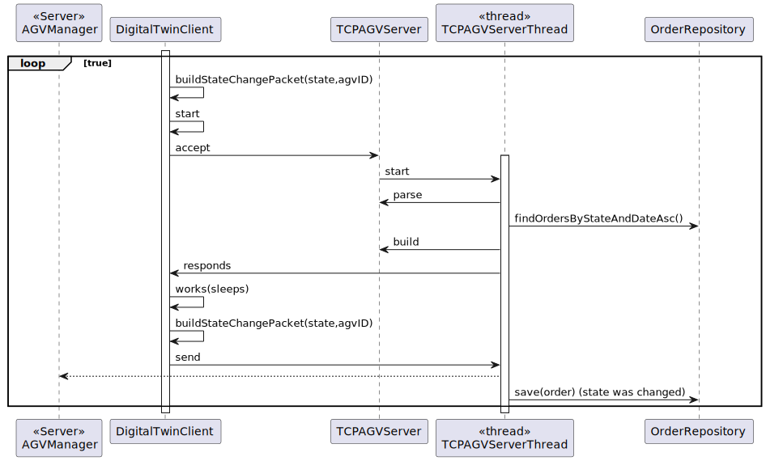
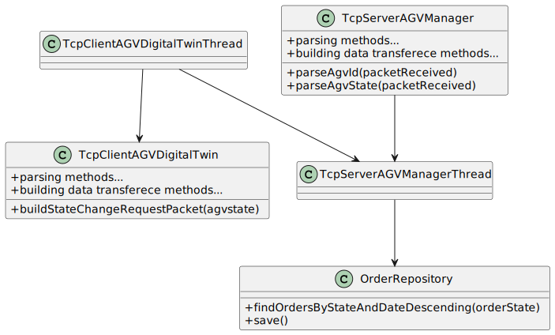

# US4002
=======================================

# 1. Requisitos

**As Project Manager, I want that the "AGVManager" component is enhanced with a basic FIFO algorithm to automatically assign tasks to AGVs.**

Sockets serão utilizados

# 2. Análise

O AGVManager é um server e irá buscar as orders à base de dados e distribui-las pelos AGV Digital twins disponiveis de acordo com o algoritmo pedido.

**Dependência(s)**

Não existem para esta US. Embora as US 5002,4001 e 4002 tenham que ter um protocolo de comunicação estabelecido.

**Fluxo Básico**

1. O Server é ligado

2. Um AGV Digital twin sinaliza que está disponivel

3. O AGV Manager vai buscar a order mais antiga e atribui ao AGV Digital twin

4. O AGV digital twin simula trabalho e informa que está livre outra vez.

O ciclo é repetido até não haver mais orders para preparar

**Esclarecimento(s) do Cliente**

Great question!

Usually, and by default, one intends that system automatically assigns orders to AGVs (US 4002).

However, if such option is not available (e.g.: turned off) or by some reason an order needs to be prepared faster than it would normally be, the warehouse employee has the ability to assign tasks manually (US 2003).

Notice that, orders that can be prepared by AGVs are being added to a queue following a FIFO algorithm (part of the US 4002). In the scope of US 2003 the FIFO algorithm does not apply... the employee might choose the order (s)he wants.

## 2.1 Futuras implementações para os outros atores

* Não existem.

## 2.2 Sequência das ações

* O server é ligado e espera conexões de AGVS com mensagems com codigo 3 e responde com codigo 4

## 2.3 Regras de negócio associadas aos atributos de uma category.

* Respeitar as regras do SPOMSP

## 2.4 Pré Condições

* n/a.

## 2.5 Pós Condições

* As requests são atendidas.

## 2.6 SSD

* Não há SSD pois ,em principio não é suposto haver interação com o utilizador.
# 3. Design

## 3.1. Realização da Funcionalidade

## 3.2. Diagrama de Classes

## 3.3. Protoco de Comunicação

* A data transferida está de acordo com o SPOMSP.

## 3.4. Testing

**Teste(s) 1:** Verificar que o Packet fica formatado de acordo com o SPOMSP.

    @Test
    void ensurePacketisWellFormatted() {
        Packet packet = new Packet((byte) 0,(byte) 1,"data".getBytes(StandardCharsets.UTF_8));
       assertEquals(packet.getCode(),1);
       assertEquals("data",packet.data());
    }

**Teste(s) 2** Verificar que o método para encontrar a order mais velha funciona

    Os tests foram realizados através da utilização da base dados e vendo o resultado

# 4. Implementação

    Atende as requests diferentes.

    case 3:
                            System.out.println("==> Request to change the state of the AGV sent by digital twin client received with success");
                            Optional<AGV> agv = agvRepository.findById(idPacketParser(packet));
                            agv.get().setAgvState(statePacketParser(packet));
                            agvRepository.save(agv.get());

                            if (statePacketParser(packet)==AGVState.OCCUPIED_SERVING_A_GIVEN_ORDER){
                                Iterable<ProductOrder> orderList=orderRepository.findByDateAscAndState(OrderState.TO_BE_PREPARED);
                                if (orderList.iterator().hasNext()){
                                    ProductOrder order=orderList.iterator().next();
                                    order.setOrderState(OrderState.BEING_PREPARED);
                                    orderRepository.save(order);
                                }

                            }
                            if (statePacketParser(packet)==AGVState.FREE){
                                Iterable<ProductOrder> orderList=orderRepository.findByDateAscAndState(OrderState.BEING_PREPARED);
                                if (orderList.iterator().hasNext()){
                                    ProductOrder order=orderList.iterator().next();
                                    order.setOrderState(OrderState.READY_FOR_CARRIER);
                                    orderRepository.save(order);

                                }
                            }
                            Packet packet1= new Packet((byte) 0,(byte) 4,"Work".getBytes(StandardCharsets.UTF_8));
                            sOut.writeObject(packet1);
                            sOut.flush();
                            System.out.println("==> Send message to the client saying it has to work");

                            break;
}

# 5. Integração/Demonstração

    O server é ligado e depois um agv será ligado para preparar as orders
    ...
# 6. Observações

    ...