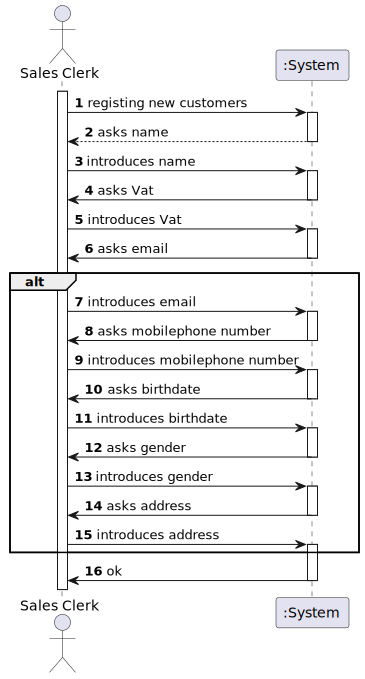
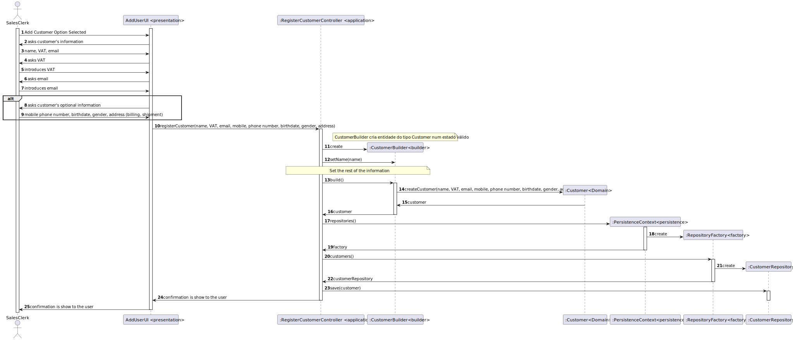
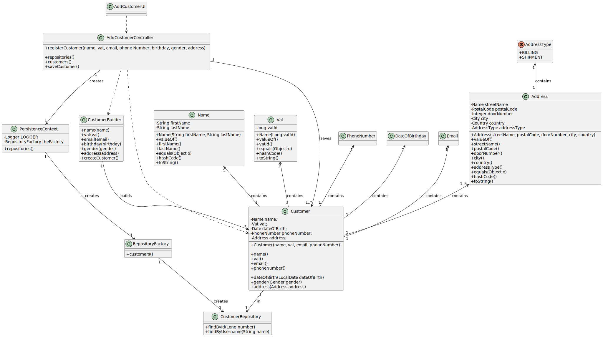

# US1003
=======================================

# 1. Requisitos

**US1003** As Sales Clerk, I want to register a new customer.

A interpretação feita deste requisito foi no sentido de registar um cliente no sistema, através da introdução de dados, para este poder navegar os catálogos
e visualizar, comprar produtos. 

# 2. Análise

## 2.1 Futuras implementações para os outros atores

* Este processo será feito pelo Sales Clerk um dos atores que podem fazer esta ação, sendo os outros 
atores o próprio cliente e um sales manager. Por este motivo esta ação será partilha por todos, logo iremos fazer esforços para que os
outros atores (o cliente e o sales manager) possam reutilizar o código desenvolvido. *

## 2.2 Sequência das ações

* O sales clerk irá perguntar ao customer algumas informações mandatárias: nome, VAT, endereço de email e um número de telemóvel. Opcionalmente pode pedir a data de nascimento,
o género e vários endereços (shipment e billing). *

## 2.3 Regras de negócio associadas aos atributos de um customer

* NOME: at least a first and last name is required. Although, desirably the customer should specify his/her full name. Considering this, apply the min/max length you consider as reasonable to meet this requirement.
* VAT: VAT ID varies from one country to another. Usually it has letters and numbers (cf. here). The system must be prepared to support/recognize several VAT Ids.
* ENDEREÇO DE EMAIL: Normal email format (something...)@(something...).(something...) eg.: test@email.com
* NÚMERO DE TELEMÓVEL:  Phone number: according to international standards (e.g.: +351 934 563 123).
* DATA DE NASCIMENTO: - Birthday: it is a date... you can adopt year/month/day.
* GÉNERO: Male | Female
* ENDEREÇO SHIPMENT E BILLING: Street name, door number, postal code, city, country.

## 2.4 Pré Condições

n/a.

## 2.5 Pós Condições

A informação dos customers é persistida.

## 2.6 SSD

# 3. Design

*Nesta secção a equipa deve descrever o design adotado para satisfazer a funcionalidade. Entre outros, a equipa deve apresentar diagrama(s) de realização da funcionalidade, diagrama(s) de classes, identificação de padrões aplicados e quais foram os principais testes especificados para validar a funcionalidade.*

Foi usado o pattern fábrica, de modo a não expor a lógica de instanciação do Customer. Isto será realizado através da implementação "DomainFactory" da framework de EAPLI.

## 3.1. Realização da Funcionalidade

## 3.2. Diagrama de Classes

## 3.3. Padrões Aplicados

* Foi utilizado o CRUD (Create, Read, Update, Delete) para trabalhar sobre os customers.

* Foi utilizado o GRASP:

* Foi utilizado o Builder, já que há certos atributos que são opcionais. O padrão builder dá-nos um processo passo a passo
para construir um objeto completo. Este processo tem sempre a mesma implementação, porém os objetos finais podem possuir
diferentes representações. Neste contexto o processo irá passar por criar os atributos obrigatórios de construtor, dando
a possibilidade de definir apenas alguns atributos opcionais. Exemplo: customer com endereço de residência, mas sem género
definido, nem data de aniversário.

* Foram utilizados o padrão repository, de modo a isolar os objetos de domínio de lógica de bases de dados. Os nossos objetos
de domínio, que por já são complexos contendo muitas regras de domínio para impor, beneficia de outra camada onde apenas
teremos lógica de bases de dados. Isto ajuda-nos a reduzir código duplicado, fazendo com que a layer de repositório 
possua capacidades de fazer querying complexo. Um repositório encapsula a lista de objetos persistidos numa base de dados
dando-nos uma visão orientada a objetos à camada de persitência. 

## 3.4. Testes 
*Nesta secção deve sistematizar como os testes foram concebidos para permitir uma correta aferição da satisfação dos requisitos.*

**Teste 1:** Verificar que não é possível criar uma instância da classe Customer com valores nulos.

	@Test(expected = IllegalArgumentException.class)
		public void ensureNullIsNotAllowed() {
		Customer instance = new Customer(null, null, null, null, null, null, null);
	}

**Teste 2:** Verificar que é possível criar uma instância da classe Customer apenas com os atributos mandatórios.

	@Test(expected = IllegalArgumentException.class)
		public void ensureNullIsNotAllowed() {
		Customer instance = new Customer(name, vat, email, phoneNumber, null, null, null);
	}

# 4. Implementação

## 4.1. Builder

    public class CustomerBuilder implements DomainFactory<Customer> {

 
    public CustomerBuilder() {
    }

    public CustomerBuilder(final String firstName, final String lastName, final String vatId, final String email
                           , final String prefix, final String phoneNumber){
        this.firstName=firstName;
        this.lastName=lastName;
        this.vatId=vatId;
        this.email=email;
        this.prefix=prefix;
        this.phoneNumber=phoneNumber;
    }

    public CustomerBuilder withSystemUser(final SystemUser systemUser) {
        this.systemUser = systemUser;
        return this;
    }
    public CustomerBuilder withBirthday(final String birthday) {
        this.birthday = birthday;
        return this;
    }

    public CustomerBuilder withGender(final Gender gender) {
        this.gender = gender;
        return this;
    }

    public CustomerBuilder withAddress(final List<Address> address) {
        this.address = address;
        return this;
    }

    @Override
    public Customer build() {
        // since the factory knows that all the parts are needed it could throw
        // an exception. however, we will leave that to the constructor
        return new Customer(Name.valueOf(firstName, lastName)
                , Vat.valueOf(vatId)
                , EmailAddress.valueOf(email)
                , PhoneNumber.valueOf(prefix, phoneNumber)
                , LocalDate.parse(birthday,ISO_LOCAL_DATE)
                , gender
                , address);
    }
## 4.2 AddCustomerController

     private final CustomerRepository repo = PersistenceContext.repositories().customers();

     public Customer customerBuilder(final String firstName, final String lastName, final String vatId, final String email,
                                    final String phoneNumber, final String birthday, final Gender gender,
                                    final List<Address> addresses) {
        CustomerBuilder customerBuilder = new CustomerBuilder(firstName, lastName, vatId, email, phoneNumber);
        Customer customer= (customerBuilder.withBirthday(birthday)
                .withGender(gender)
                .withAddress(addresses)
                .build());
        for (Address adr: addresses) {
            adr.setCustomer(customer);
        }
        if(customer != null) {
            return repo.save(customer);
        }
        return null;
    }

    public void validateEmail(String email) {
        EmailAddress.valueOf(email);
    }

    public void validateVat(String vat) {
        Vat.vatMeetsMinimumRequirements(vat);
    }

    public void validatePhoneNumber(String phoneNumber) {
        PhoneNumber.phoneMeetsMinimumRequirements(phoneNumber);
    }

## AddCustomerUI
    protected boolean doShow() {
       final String firstName = Console.readLine("First Name");
        final String lastName = Console.readLine("Last Name");
        final String vatId = inputVat();
        final String email = inputEmail();
        final String phoneNumber = inputPhoneNumber();

        String response = Console.readLine("Birthday: This field is optional. Do you want to define it? (y/n)");
        if (response.equalsIgnoreCase("yes") || response.equalsIgnoreCase("y")) {
            boolean passedValidation;
            do {
                try {
                    birthday = inputBirthDate();
                    passedValidation = true;
                } catch (DateTimeException dateTimeException) {
                    passedValidation = false;
                    System.out.println("There was an error while analysing the date introduce. Please try again!");
                }
            } while (!passedValidation);
        }
        response = Console.readLine("Gender: This field is optional. Do you want to define it? (y/n)");
        if (response.equalsIgnoreCase("yes") || response.equalsIgnoreCase("y")) {
            gender = selectGender();

        }
        response = Console.readLine("Address: This field is optional. Do you want to define it? (y/n)");
        String moreAddresses;
        Address address;
        List<Address> addresses = new ArrayList<>();
        if (response.equalsIgnoreCase("yes") || response.equalsIgnoreCase("y")) {
            do {
                address = askAddress();
                addresses.add(address);
                moreAddresses = Console.readLine("Do you want to define more addresses? (y|n)");
            } while (moreAddresses.equalsIgnoreCase("yes") || moreAddresses.equalsIgnoreCase("y"));
        }
        Customer customer = null;
        try {
            customer = theController.customerBuilder(firstName, lastName, vatId, email, phoneNumber, birthday, gender, addresses);
        } catch (Exception e) {
            System.out.println(e.getMessage());
        }
        try {

            System.out.println(customer);
        } catch (final IntegrityViolationException | ConcurrencyException e) {
            System.out.println("That username is already in use.");
        }

        final String credentialsCreation = Console.readLine("Do you want to create the customers' credentials?");

        if (credentialsCreation.equalsIgnoreCase("yes") || credentialsCreation.equalsIgnoreCase("y")) {
            System.out.println("Use Case 3.1.5: yet to be implemented. (Check the \"system to develop\" pdf)");
        }

        return false;
    }

# 5. Integração/Demonstração

- Foi adicionada uma opção (Customer -> Create new Customer) ao menu do SalesClerk.

- Devem ser inseridas as informações do customer, tendo o sistema verificações de forma a cumprir os requisitos fornecidos pelo sales clerk.
# 6. Observações

