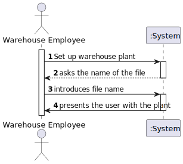
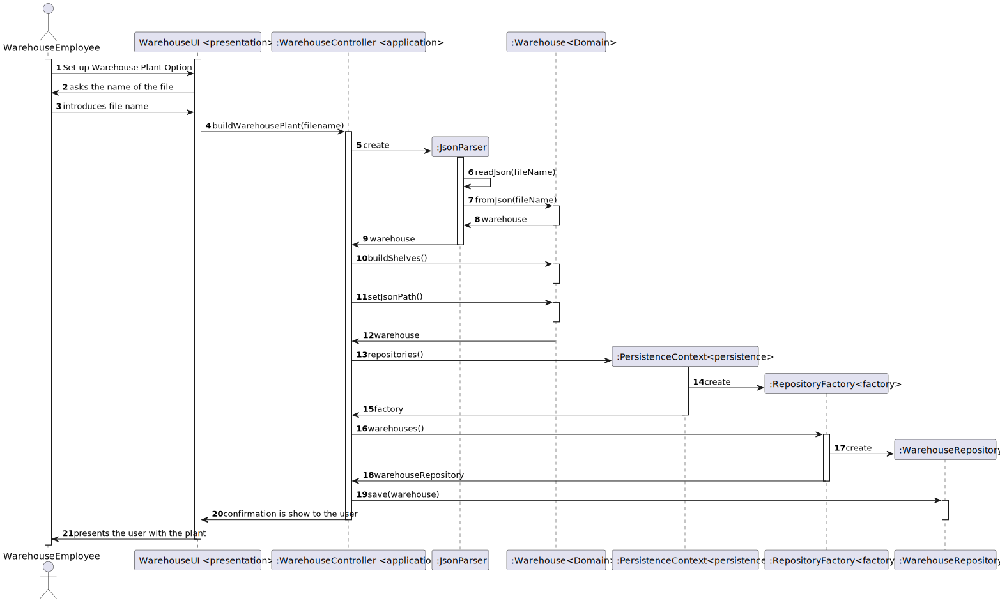
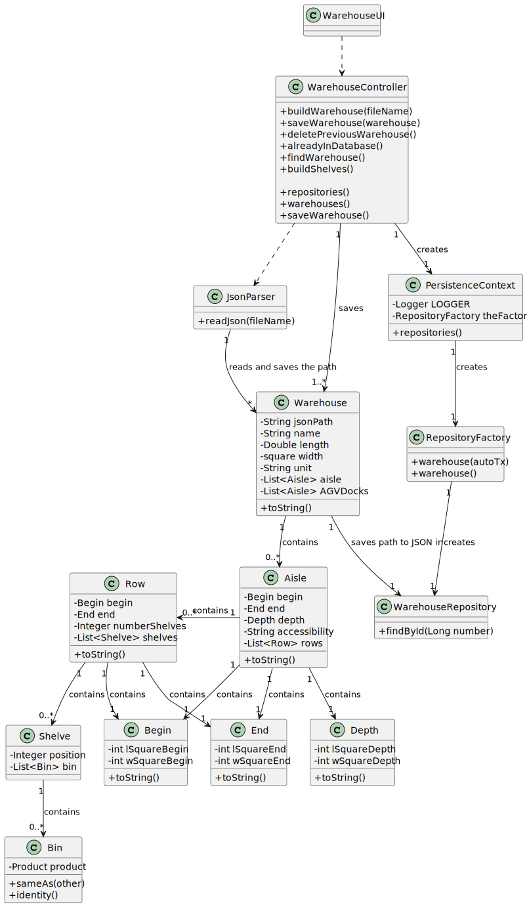

# US2001
=======================================

# 1. Requisitos

**US2001** As Warehouse Employee, I want to set up the warehouse plant by uploading a JSON file.

A interpretação feita deste requisito foi no sentido de importar a planta de um armazém no sistema, através do uso de JSON.

# 2. Análise

## Nota importante: 
* A User Story era desenvolvido de modo à Warehouse estar persistida na base de dados. Isto é: A planta da warehouse era transformada em Objetos e estes eram persistidos.
* Após o email do Regente de EAPLI no dia 28/04/2022, a equipa viu que o levantamento dos requisitos não estavam em conformidade com a realidade. Os requisitos seriam apenas persistir o path do JSON e fazer verificações dos AGVDocks e dos Product Locations.
* Como a estrutura em objetos do Warehouse já estava toda realizada para ser persistida, esta estrutura foi reutilizada para fazer as validações do Product Location e do AGV base dock. Aquando de criar um produto ou configurar um AGV é pedido através de input selecionado a localização pretendida entre as possíveis. Caso já esteja lá algum produto ou AGV o user é avisado de tal.

## 2.1 Sequência das ações

* O sistema irá perguntar o nome do ficheiro a introduzir. Apenas será necessário o nome do ficheiro, já que estes serão
guardados num diretório pré-definido (warehouses).

## 2.2 Pré Condições

n/a.

## 2.3 Pós Condições

Validar o base dock dos AGV e o product Location do Product.

## 2.4 Perguntas ao cliente

### 2.4.1 WareHousePlant 2001
Q: The WareHousePlant should be displayed in the console in a matrix for the WareHouse Employee?
Or there is more efficient way to display the dashboard? It's an important requirement for US 2001?

A: US 2001 is just to set up the warehouse plant by uploading a file.
As so, it is not necessary to graphically display the warehouse plant.
Moreover, notice that a warehouse plant will be displayed in the scope of US 2005 (web dashboard, in sprint C).

### 2.4.2 Warehouse plant
Q: Does a warehouse always have the same plant or can it have different plants in the future?

A:
Each warehouse has its own plant and, therefore, plants might vary from one warehouse to another.
However, any warehouse plant is described by a JSON file according to the data structure described in section 5.2 of the specifications' document.
On US2001, any JSON file meeting such data structure must be supported.

### 2.4.3 US2001
Q: Regarding US2001, should the warehouse employee select from a list the warehouse he wants to set up the plant or should he type, for example, the id of the warehouse he wants to set up the plant?

A: Within this prototype, for the sake of simplicity, there is only 1 (one) warehouse.

### 2.4.4 Uploading a JSON file
Q: Regarding the upload of a JSON file, is that file supposed to be stored with the rest of the application and be uploaded every time the application runs or should the upload be done only once where the information would all be uploaded to the application database and the JSON file discarded/not stored?

A: The purpose of uploading a JSON file (US2001) is to set up the warehouse plant information required to the system work properly.
Once that information is set up, there is no need to repeat the set up process. As so, if a JSON file is found the user might be prompt if (s)he wants to update the information about the warehouse plant. The user might also update the information by re-executing the US2001.
Yet, it is worth noticing that the JSON file might not be available on all workstations used by warehouse employees.
As so, persisting warehouse plant data on the database seems to be a good option.

### 2.4.5 US2001 - Shelves in an aisle
Q: Regarding the shelves in each row that are part of an aisle, is there a need to differentiate them? If not, how will the AGV know on which shelf to look for a product? Because, as we understood, different products can be placed on a different shelf of the same row, and according to the JSON file provided, each row only states how many shelves it has.

A: Yes! You need to differentiate the shelves in each row of an aisle.
Recall that "The products’ location in the warehouse, which corresponds to a storage area i.e., the aisle identifier, the row identifier, and the shelf identifier. All these identifiers are numeric."
As you have noticed, each row states how many shelves it has. As so, if a row states it has 4 shelves, it means that the row shelves are identified as shelf 1, 2, 3 and 4 from the bottom to the top.
If another row stated it has 3 shelves, it means that such row shelves are identified as shelf 1, 2 and 3 again from the bottom to the top.
I hope this clarifies your doubt.

## 2.5 SSD

# 3. Design

## 3.1. Realização da Funcionalidade

## 3.2. Diagrama de Classes

## 3.3. Padrões Aplicados

* Foi utilizado o CRUD (Create, Read, Update, Delete) para guardar o path do JSON da warehouse.

* Foi utilizado o GRASP

* Foram utilizados o padrão repository, de modo a isolar os objetos de domínio de lógica de bases de dados. Os nossos objetos
  de domínio, que por já são complexos contendo muitas regras de domínio para impor, beneficia de outra camada onde apenas
  teremos lógica de bases de dados. Isto ajuda-nos a reduzir código duplicado, fazendo com que a layer de repositório
  possua capacidades de fazer querying complexo. Um repositório encapsula a lista de objetos persistidos numa base de dados
  dando-nos uma visão orientada a objetos à camada de persitência.

## 3.4. Testes 

# 4. Implementação

## 4.1. JsonParser
    public Warehouse readJson(String fileName) throws FileNotFoundException {
      GsonBuilder builder = new GsonBuilder();
      Gson gson = builder.create();
      if(!fileName.contains(".json")) {
        fileName = fileName + ".json";
      }
      BufferedReader bufferedReader = new BufferedReader(new FileReader("warehouse/"+ fileName));
      return gson.fromJson(bufferedReader, Warehouse.class);
    }
## 4.2 WarehouseController
    private final WarehouseRepository repo = PersistenceContext.repositories().warehouse();

    public Warehouse buildWarehousePlant(String fileName) throws FileNotFoundException {
        JsonParser jsonParser = new JsonParser();
        return jsonParser.readJson(fileName);
    }

    public void buildShelves(Warehouse warehouse)   {
        for (Aisle aile : warehouse.aisles()) {
            for (Row row : aile.rows()) {
                row.convertShelveNumberToPosition();
            }
        }
    }

    public void saveWarehouse(Warehouse warehouse) {
        repo.save(warehouse);
    }

    public boolean alreadyInDatabase() {
        int contagem = 0;
        Iterable<Warehouse> warehouse = repo.findAllActive();
        Iterator<Warehouse> it = warehouse.iterator();
        while (it.hasNext()) {
            it.next();
            contagem++;
        }
        return contagem > 0;
    }

    public Warehouse findWarehouse() {
        return repo.findAllActive().iterator().next();
    }

    public void deletePreviousWarehouse() {
        for (Warehouse warehouse : repo.findAllActive()) {
            repo.remove(warehouse);
        }
    }

    
## WarehouseUI
          protected boolean doShow() {
          String response = "y";
          boolean alreadyExistsInDatabase = theController.alreadyInDatabase();
          if (alreadyExistsInDatabase) {
          response = Console.readLine("Warehouse plant is already database do you want still to import it?");
          }
          if (((response.equalsIgnoreCase("y") || response.equalsIgnoreCase("yes")) && theController.alreadyInDatabase()) || !theController.alreadyInDatabase()) {
          String fileName;

            boolean passed;
            do {
                fileName = Console.readLine("File Name");

                try {
                    Warehouse warehouse = theController.buildWarehousePlant(fileName);
                    theController.buildShelves(warehouse);
                    warehouse.setJsonPath(fileName);
                    saveWarehouse(warehouse, alreadyExistsInDatabase);
                    System.out.println(warehouse);
                    passed = true;
                } catch (FileNotFoundException e) {
                    System.out.println("There is no file with that name. Please check the name of the JSON and try again!");
                    passed = false;
                }
            } while (!passed);
        }
        return true;
    }
    

# 5. Integração/Demonstração

- Foi adicionada uma opção (Warehouse -> Set up new Warehouse) ao menu do Warehouse Employee.

- Deve ser introduzida o nome do file json, tendo o sistema já adicionado diretório ao path.

# 6. Observações

*Nesta secção sugere-se que a equipa apresente uma perspetiva critica sobre o trabalho desenvolvido apontando, por exemplo, outras alternativas e ou trabalhos futuros relacionados.*

