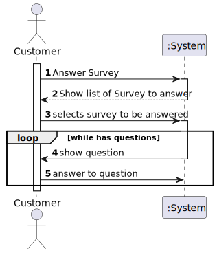
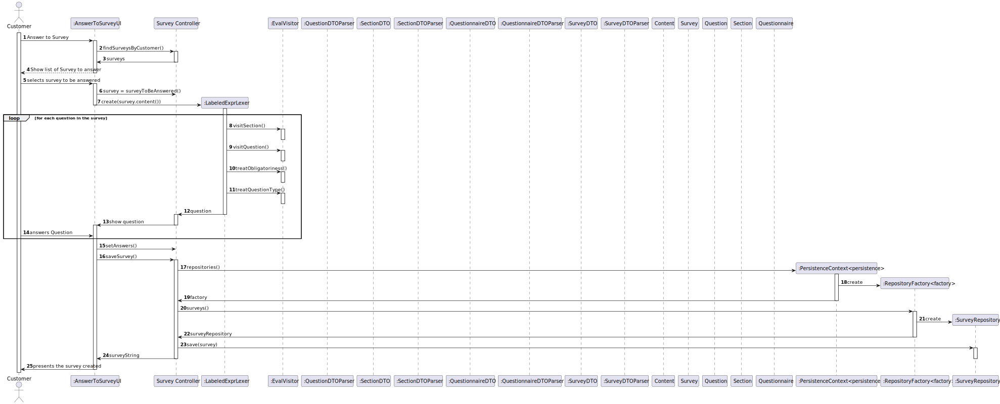
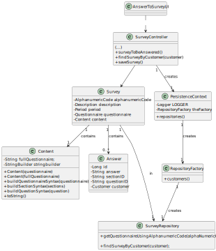

# US3501

=======================================

# 1. Requisitos

**US3501** As Sales Manager, I want to create a new questionnaire to be further answered by customers meeting the specified criteria (e.g.: have ordered a given product; belong to a given age group).

A interpretação feita deste requisito foi no sentido de criar um questionário (txt ou pela aplicação), este questionário estará associado a uma população alvo. (Pertence a um certo grupo etário, ter pedido um certo produto etc.).

# 2. Análise

Para posteriormente serem feitos relatórios estatísticos será necessário persistir os seguintes dados:

Answer: QuestionID, SurveyID, SectionID, RESPOSTA (String), CustomerID

## 2.1 Sequência das ações

* O customer diz que quer responder a um questionário.
  Após escolher o questionário da lista disponível.
  Começa a responder o questionário.  

## 2.2 Pré Condições

* Ter questionário.

## 2.3 Pós Condições

* Fazer relatórios estatísticos.

## 2.4 Perguntas ao cliente

### 2.4.1 US3001 - Section
Q1: When a Section has a Question tagged as "Mandatory" should the section become "Mandatory" as well?
Q2: Can you specify what you mean when a Question/Section is tagged with "condition dependent" and the type of conditions to be set.

([Link](https://moodle.isep.ipp.pt/mod/forum/discuss.php?d=16388))

## 2.5 SSD

# 3. Design

## 3.1. Realização da Funcionalidade

## 3.2. Diagrama de Classes

## 3.3. Padrões Aplicados

### O strategy pattern está a ser ponderado para os seguintes pontos do system description:
> (i) the ability to generate dynamically (at runtime) a proper user interface (UI) for any given questionnaire;
> (i) to validate a given questionnaire response in accordance with the questionnaire specification

Principalmente para o ponto i, onde o UI, principalmente das questões serão apresentadas conforme o question type da
mesma questão.
Irá ser definido uma interface com os comportamentos típicos de uma questão. Nomeadamente a forma de apresentação ao cliente, a forma de resolver exemplo (sorting options apresenta todas as opções, deixando ordenar por ordem de importância as opções).
É de realçar que no início da apresentação de uma questão 'sorting options' não há uma ordem pré-definida, sendo a ordem definida
pelo utilizador.

* Foi utilizado o CRUD (Create, Read, Update, Delete) para trabalhar sobre os surveys.

* Foi utilizado o GRASP: no uso de DTOS, para alta coesão e acoplamento reduzido. Polimorfismo para gerir os métodos que
  criam o survey, caso o survey é criado com o txt ou a introduzir os dados. Pure fabrication (Content) to create the syntax

* Foi utilizado o Builder, já que há certos atributos que são opcionais. O padrão builder dá-nos um processo passo a passo
  para construir um objeto completo. Este processo tem sempre a mesma implementação, porém os objetos finais podem possuir
  diferentes representações. Neste contexto o processo irá passar por criar os atributos obrigatórios de construtor, dando
  a possibilidade de definir apenas alguns atributos opcionais. Exemplo: customer com endereço de residência, mas sem género
  definido, nem data de aniversário.

* Foram utilizados o padrão repository, de modo a isolar os objetos de domínio de lógica de bases de dados. Os nossos objetos
  de domínio, que por já são complexos contendo muitas regras de domínio para impor, beneficia de outra camada onde apenas
  teremos lógica de bases de dados. Isto ajuda-nos a reduzir código duplicado, fazendo com que a layer de repositório
  possua capacidades de fazer querying complexo. Um repositório encapsula a lista de objetos persistidos numa base de dados
  dando-nos uma visão orientada a objetos à camada de persitência.

## 3.4. Testes 

# 4. Implementação

### Builder Section

    public class SectionBuilder implements DomainFactory<Section> {

    private String sectionId;
    private String sectionTitle;
    private String sectionDescription;
    private String obligatoriness;
    private String repeatability;
    private final List<Question> questions = new ArrayList<>();

    protected SectionBuilder() {

    }

    public SectionBuilder(String sectionId, String sectionTitle, String obligatoriness) {
        Preconditions.noneNull(sectionId, sectionTitle, obligatoriness);
        this.sectionId = sectionId;
        this.sectionTitle = sectionTitle;
        this.obligatoriness = obligatoriness;
    }

    public SectionBuilder withSectionDescription(final String sectionDescription) {
        this.sectionDescription = sectionDescription;
        return this;
    }

    public SectionBuilder withRepeability(final String repeatability) {
        this.repeatability = repeatability;
        return this;
    }

    @Override
    public Section build() {
        // since the factory knows that all the parts are needed it could throw
        // an exception. however, we will leave that to the constructor
        return new Section(sectionId, sectionTitle, Description.valueOf(sectionDescription), Obligatoriness.valueOf(obligatoriness), repeatability, questions);
    }

### Survey

    public class Survey implements AggregateRoot<AlphaNumericCode>, DTOable<SurveyDTO> {
    @Id
    @Column(nullable = false)
    private AlphaNumericCode alphaNumericCode;

    @Embedded
    private Description description;

    @Embedded
    @Column(name = "period_in_days")
    private Period period;

    @Embedded
    private Questionnaire questionnaire;

    @Embedded
    private Content content;

    protected Survey() {
        //ORM
    }

    @Override
    public boolean sameAs(Object other) {
        Survey otherSurvey = (Survey) other;
        return alphaNumericCode.equals(otherSurvey.alphaNumericCode);
    }

    @Override
    public AlphaNumericCode identity() {
        return alphaNumericCode;
    }

    public void addContentToSurvey(Content content) {
        this.content = content;
    }

    @Override
    public String toString() {
        if(questionnaire!= null) {
            return "Survey{" +
                    "alphaNumericCode=" + alphaNumericCode +
                    ", description=" + description +
                    ", period=" + period +
                    ", questionnaire=" + questionnaire +
                    ", content=" + content +
                    '}';
        }else{
            return "Survey{" +
                    "alphaNumericCode=" + alphaNumericCode +
                    ", description=" + description +
                    ", period=" + period +
                    ", content=" + content +
                    '}';
        }
    }

    public Survey(AlphaNumericCode alphaNumericCode, Description description, Period period, Questionnaire questionnaire) {
        this.alphaNumericCode = alphaNumericCode;
        this.description = description;
        this.period = period;
        this.questionnaire = questionnaire;
        this.content = new Content(questionnaire);
    }
    public Survey(AlphaNumericCode alphaNumericCode, Description description, Period period ) {
        this.alphaNumericCode = alphaNumericCode;
        this.description = description;
        this.period = period;
    }

    public Survey(AlphaNumericCode alphaNumericCode, Description description, Period period, Content content) {
        this.alphaNumericCode = alphaNumericCode;
        this.description = description;
        this.period = period;
        this.content = content;
    }

    /**
     * Showcase the {@link DTOable} interface. In this case it is the Dish class
     * that dictates the DTO structure.
     *
     *
     */
    @Override
    public SurveyDTO toDTO() {
        return new SurveyDTO(alphaNumericCode.code(),
                description.toString(),
                period.toString());
    }

### Controller
    public class SurveyController {

    private Questionnaire questionnaire = null;
    private final List<Section> sections = new ArrayList<>();
    private List<Question> questions = new ArrayList<>();
    private final SurveyRepository repo = PersistenceContext.repositories().surveys();
    private Content content;
    private Survey newSurvey;

    public SurveyDTO buildSurvey(final SurveyDTO dto, int flagFile) {
        if (flagFile == 1) {
            newSurvey = new SurveyDTOParser().valueOf(dto);
            newSurvey.addContentToSurvey(new Content(dto.content));
            repo.save(newSurvey);
            return newSurvey.toDTO();
        } else {
            newSurvey = new SurveyDTOParser().valueOf(dto);
            content = new Content(questionnaire);
            newSurvey.addContentToSurvey(content);
            repo.save(newSurvey);
            return newSurvey.toDTO();
        }
    }

    public QuestionnaireDTO buildQuestionnaire(final QuestionnaireDTO dto) {
        questionnaire = new QuestionnaireDTOParser().valueOf(dto);
        questionnaire.setSections(sections);
        return questionnaire.toDTO();
    }

    public void buildSections(final SectionDTO dto) {
        final var newSection = new SectionDTOParser().valueOf(dto);
        sections.add(newSection);
        newSection.setContent(questions);
    }

    public QuestionDTO buildQuestions(final QuestionDTO dto) {
        final var newQuestion = new QuestionDTOParser().valueOf(dto);
        questions.add(newQuestion);
        return newQuestion.toDTO();
    }

    public void cleanQuestionList() {
        questions = new ArrayList<>();
    }

    public String receiveSurveyString() {
        return newSurvey.toString();
    }

    public String receiveFullQuestionnaireString() {
        return content.toString();
    }

# 5. Integração/Demonstração

- Foi adicionada uma opção (Survey -> Define new Survey) ao menu do Sales Manager.

# 6. Observações

