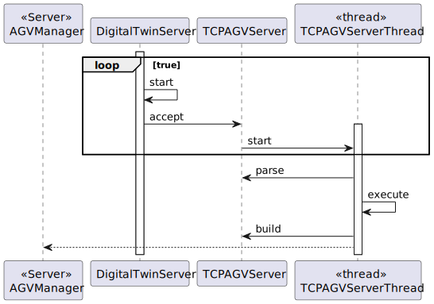

# US5002
=======================================

# 1. Requisitos

**US5002** As Project Manager, I want that the team start developing the output communication module of the AGV digital twin to update its status on the "AGVManager".

A interpretação feita deste requisito foi no sentido de criar server, client usando TCP, que consiga dar update ao status do AGVManager, no caso desta US será apenas o output.

# 2. Análise

O cliente pode se comunicar usando sockets e o servidor irá responder de acordo com o protocolo de comunicação em curso:

0 COMMTEST - Communications test request with no other effect on the server application than
the response with a code two message (ACK). This request has no data.

1 DISCONN - End of session request. The server is supposed to respond with a code two message,
afterwards both applications are expected to close the session (TCP connection). This request
has no data.

2 ACK - Generic acknowledgment message. Used in response to requests with codes zero and
one but may be used for other requests. This response has no data.

3 : Change State Request . Message sent to the server requesting state change in the database.
Contains Data that signifies the state that will be changed to and the AGV Identification.
Answered with code 2 or code 4 message.

4:Command Request. Message sent to the agvDigitalTwin to simulate it doing something.

5: Get AGV STATUS Request .Request sent to the server

6:Response to Status Request

## 2.1 Sequência das ações

* Não há ações, o programa ir correr paralelamente.

## 2.2 Pré Condições

Ter o cliente, que manda pedidos ao server (desenvolvido nesta US).

## 2.3 Pós Condições

Cliente receber as mensagens.

## 2.4 Perguntas ao cliente

### 2.4.1 USs 1901/4001/5001/5002
Q:
Dear Client
Regarding the USs 1901,4001, 5001, and 5002, what would you consider its complete state, that is, what would be the criterion to define whether or not this US is functional?
Best Regards

A:

For all of those US, the communication between the two involved components must be implemented in accordance with the SPOMS2022. The requests processing can be somehow mocked. For instance, if processing a request implies saving some data to the database, the component can instead write such data to a log (mocking). Latter, on next sprint, the teams implement the interaction to the database.
However, it is not advisable mocking everything, namely the components (internal) state. Notice that by mocking you are letting extra effort to the next sprint.
Finally, all US must be demonstrable.

([Link](https://moodle.isep.ipp.pt/mod/forum/view.php?id=93680))

### 2.4.2 US5001, US5002
Q:
Dear Client,
I have a question about the input and output communication between the AGV DIgital Twin and the AGV Manager.
Q: What type of communication do you want, i.e., what are the communications that you want to have between these two. Like AGV Manager says "Take a product" and AGV Digital Twin says "Taken"? Is it something like that? Or am i confused?

A:
The communication must follow the SPOMS2022 protocol.
It is up to you and your team to devise a set of messages fulfilling the business requirements properly.

([Link](https://moodle.isep.ipp.pt/mod/forum/discuss.php?d=16593))

## 2.5 SSD

Não possui.

# 3. Design

As principais dúvidas sobre este caso de uso são:

Esta funcionalidade será fornecida com um socket de server num endereço conhecido, sendo usado o TCP como mecanismo de transporte. Os clientes precisarão de conhecer o IP do server e da porta.

Irá ser utilizado uma thread, como parte do processo TCP, uma vez que o servidor pode tratar vários requests de maneira
concorrente.

## 3.1. Realização da Funcionalidade

## 3.2. Diagrama de Classes

## 3.3. Padrões Aplicados

* Foi utilizado o pensamento Client Server. Em que o cliente faz pedidos ao servidor, sendo que este responde com o
que foi pedido.

## 3.4. Testes 

Os testes serão realizados principalmente ao parser, já que o resto é difícil de testar.

# 4. Implementação

    class TcpServerAGVDigitalTwin {
    static ServerSocket sock;
    private static final  int PORT_NUMBER = 2020;

    public static void main(String[] args) throws Exception {
        Socket cliSock;
        System.out.println("Server side: Waiting for requests");

        try {
            sock = new ServerSocket(PORT_NUMBER);
        } catch (IOException ex) {
            System.out.println("Failed to open server socket");
            System.exit(1);
        }

        while (true) {
            cliSock = sock.accept();
            new Thread(new TcpServerAGVDigitalTwinThread(cliSock)).start();
        }
    }
    }

    /* THREAD*/
    class TcpServerAGVDigitalTwinThread implements Runnable {
    private final Socket s;
    private ObjectOutputStream sOut;
    private ObjectInputStream sIn;

    public TcpServerAGVDigitalTwinThread(Socket cli_s) {
        s = cli_s;
    }

    public void run() {
        InetAddress clientIP;

        clientIP = s.getInetAddress();
        System.out.println("New client connection from " + clientIP.getHostAddress() +
                ", port number " + s.getPort());
        try {
            sOut = new ObjectOutputStream(s.getOutputStream());
            sIn = new ObjectInputStream(s.getInputStream());
            while(true) {
                Packet packet = null;
                try {
                    packet = (Packet) sIn.readObject();
                } catch (ClassNotFoundException e) {
                    e.printStackTrace();
                }

                Packet packetWrite = new Packet((byte) 0, (byte) 2, "Acknowledged".getBytes(StandardCharsets.UTF_8));

                switch (packet.getCode()) {
                    case 0:
                        System.out.println("==> Request to test the connection sent by Client received with success");
                        //Dizer ao cliente que entendeu
                        System.out.println("==> Send message to the client saying it understood the request");
                        sOut.writeObject(packetWrite);
                        sOut.flush();
                        break;
                    case 1:
                        try {
                            System.out.println("==> Request to end connection sent by Client received with success");
                            //Dizer ao cliente que entendeu
                            System.out.println("==> Send message to the client saying it understood the request");
                            sOut.writeObject(packetWrite);
                            sOut.flush();
                            System.out.println("==> Client " + clientIP.getHostAddress() + ", port number: " + this.s.getPort() + " disconnected");
                        } catch (IOException e) {
                            System.out.println("==> ERROR: " + e.getMessage());
                        } finally {
                            try {
                                this.s.close();
                            } catch (IOException e) {
                                System.out.println("ERROR: Error while closing the socket");
                            }
                            System.out.println("==> INFO: Socket closed with Success\n\n");
                        }
                        break;

                    default:
                        System.out.println("==> ERROR: Error while sending the packet to the client");
                        break;

                }
            }
        } catch (IOException ex) {
            System.out.println("IOException");
        }
    }
}

# 5. Integração/Demonstração

# 6. Observações

