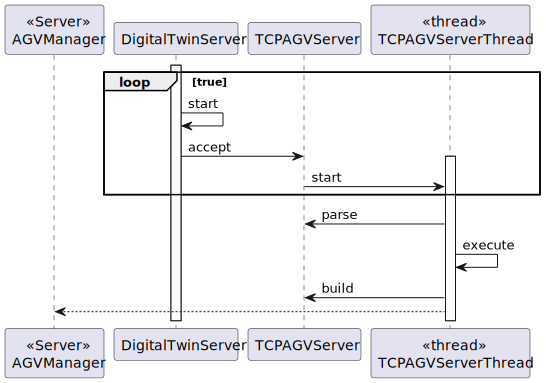
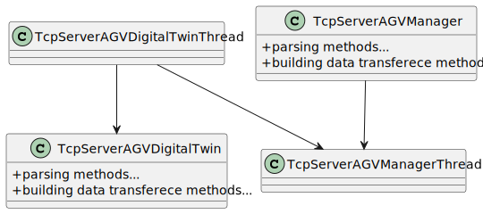

# US5004
=======================================

# 1. Requisitos

**US5004** As Project Manager, I want the output communications  (of the AGV Digital Twin) made through the SPOMS2022 protocol to be secured/protected.

Iremos reutilizar o código produzido na iteração anterior para "pôr" por cima do TCP uma segurança adicional (SSL).

Isto está em conformidade com o acceptance criteria da US

"It should be adopted SSL/TLS with mutual authentication based on public key certificates.
 It complements the US5002."

# 2. Análise

O cliente pode se comunicar usando sockets e o servidor irá responder de acordo com o protocolo de comunicação em curso:

0 COMMTEST - Communications test request with no other effect on the server application than
the response with a code two message (ACK). This request has no data.

1 DISCONN - End of session request. The server is supposed to respond with a code two message,
afterwards both applications are expected to close the session (TCP connection). This request
has no data.

2 ACK - Generic acknowledgment message. Used in response to requests with codes zero and
one but may be used for other requests. This response has no data.

3 : Change State Request . Message sent to the server requesting state change in the database.
Contains Data that signifies the state that will be changed to and the AGV Identification.
Answered with code 2 or code 4 message.

4:Command Request. Message sent to the agvDigitalTwin to simulate it doing something.

5: Get AGV STATUS Request .Request sent to the server

6:Response to Status Request

### Está feito em JAVA e em C, sendo atualmente usado o C.
## No terminal foram utilizados os seguintes comandos para criar as public key certificates para JAVA.

1 - First Generate the server Certificate and public/private key and store it in keystore file

keytool -genkey -keyalg RSA -keysize 2048 -validity 360 -alias mykey -keystore server.jks

RESPOSTAS:
-----------------------------------------------
Enter keystore password:SPOMS@G05_2DH

What is your first and last name?2DH

What is the name of your organizational unit?SPOMS

What is the name of your organization?SPOMS

What is the name of your City or Locality?Porto

What is the name of your State or Province?Porto

What is the two-letter country code for this unit?PT

-----------------------------------------------
2 - Export the certficate and the public key that should be send to the client.

keytool -export -alias mykey -keystore server.jks -file server.cert

3 - Add the key at the client side to a TrustedStore to trust the server

keytool -import -file server.cert -alias mykey -keystore server.jts

//Filename

server.jks

//KeyStore Password

SPOMS@G05_2DH -> Keystore password

## No terminal foram utilizados os seguintes comandos para criar as public key certificates para C.

openssl req -nodes -x509 -keyout A.key -out A.pem -days 365 -newkey rsa:2048

keytool -genkey -v -alias B -keyalg RSA -keysize 2048 -validity 365 -keystore B.jks –storepass secret

keytool -exportcert -alias B -keystore B.jks -storepass secret -rfc -file B.pem

SSL_CTX_load_verify_locations(ctx, ”B.pem”, NULL);

## 2.1 Sequência das ações

* Não há ações, o programa ir correr paralelamente.

## 2.2 Pré Condições

Ter o cliente, que manda pedidos ao server (desenvolvido nesta US).

## 2.3 Pós Condições

Cliente receber as mensagens.
Clientes podem-se conectar com o certificado.

## 2.4 Perguntas ao cliente

### 2.4.1 USs 1901/4001/5001/5002
Q:
Dear Client
Regarding the USs 1901,4001, 5001, and 5002, what would you consider its complete state, that is, what would be the criterion to define whether or not this US is functional?
Best Regards

A:

For all of those US, the communication between the two involved components must be implemented in accordance with the SPOMS2022. The requests processing can be somehow mocked. For instance, if processing a request implies saving some data to the database, the component can instead write such data to a log (mocking). Latter, on next sprint, the teams implement the interaction to the database.
However, it is not advisable mocking everything, namely the components (internal) state. Notice that by mocking you are letting extra effort to the next sprint.
Finally, all US must be demonstrable.

([Link](https://moodle.isep.ipp.pt/mod/forum/view.php?id=93680))

### 2.4.2 US5001, US5002
Q:
Dear Client,
I have a question about the input and output communication between the AGV DIgital Twin and the AGV Manager.
Q: What type of communication do you want, i.e., what are the communications that you want to have between these two. Like AGV Manager says "Take a product" and AGV Digital Twin says "Taken"? Is it something like that? Or am i confused?

A:
The communication must follow the SPOMS2022 protocol.
It is up to you and your team to devise a set of messages fulfilling the business requirements properly.

([Link](https://moodle.isep.ipp.pt/mod/forum/discuss.php?d=16593))

## 2.5 SSD

Não possui.

# 3. Design

As principais dúvidas sobre este caso de uso são:

Esta funcionalidade será fornecida com um socket de server num endereço conhecido, sendo usado o TCP como mecanismo de transporte. Os clientes precisarão de conhecer o IP do server.

Irá ser utilizado uma thread, como parte do processo TCP, uma vez que o servidor pode tratar vários requests de maneira
concorrente.

## 3.1. Realização da Funcionalidade

## 3.2. Diagrama de Classes

## 3.3. Padrões Aplicados

* Foi utilizado o pensamento Client Server. Em que o cliente faz pedidos ao servidor, sendo que este responde com o
que foi pedido.

## 3.4. Testes 

Os testes serão realizados principalmente ao parser, já que o resto é difícil de testar.

# 4. Implementação

    #include <stdlib.h>
    #include <unistd.h>
    #include <stdio.h>
    #include <string.h>
    #include <sys/types.h>
    #include <sys/socket.h>
    #include <netinet/in.h>
    #include <arpa/inet.h>
    #include <netdb.h>
    
    #include <openssl/crypto.h>
    #include <openssl/ssl.h>
    #include <openssl/err.h>
    #include <openssl/conf.h>
    #include <openssl/x509.h>
    
    #define SERVER_SSL_CERT_FILE "B.pem"
    
    #define BUF_SIZE 60
    #define SERVER_PORT "2020"
    
    // read a string from stdin protecting buffer overflow
    #define GETS(B,S) {fgets(B,S-2,stdin);B[strlen(B)-1]=0;}
    
    void sendWarehouse(char *ip, char *cli, int sendWarehouse [18][20]) {
    int err, sock;
    char line[BUF_SIZE];
    struct addrinfo  req, *list;
    
    /*
    if(argc<2) {
    printf("\nUsage:\n\n%s SERVER-IP [CLIENT-NAME]\n\n",argv[0]);
    puts("SERVER-IP: Server's IPv4/IPv6 address or DNS name.");
    puts("CLIENT-NAME: base filename to load client's certificate and private key.");
    puts("             !!! If not provided, the client will not use a certificate.\n");
    exit(1);
    }*/

	bzero((char *)&req,sizeof(req));
	// let getaddrinfo set the family depending on the supplied server address
	req.ai_family = AF_UNSPEC;
	req.ai_socktype = SOCK_STREAM;
	err=getaddrinfo(ip, SERVER_PORT , &req, &list);
	if(err) {
        	printf("Failed to get server address, error: %s\n",gai_strerror(err)); exit(1); }

	sock=socket(list->ai_family,list->ai_socktype,list->ai_protocol);
	if(sock==-1) {
        	perror("Failed to open socket"); freeaddrinfo(list); exit(1);}

	if(connect(sock,(struct sockaddr *)list->ai_addr, list->ai_addrlen)==-1) {
        	perror("Failed connect"); freeaddrinfo(list); close(sock); exit(1);}
	//puts("Connected");

	const SSL_METHOD *method=SSLv23_client_method();
        SSL_CTX *ctx = SSL_CTX_new(method);

	
		// Load client's certificate and key
		strcpy(line,cli);strcat(line,".pem");
		SSL_CTX_use_certificate_file(ctx, line, SSL_FILETYPE_PEM);
		strcpy(line,cli);strcat(line,".key");
        	SSL_CTX_use_PrivateKey_file(ctx, line, SSL_FILETYPE_PEM);
        	if (!SSL_CTX_check_private_key(ctx)) {
                	puts("Error loading client's certificate/key");
			close(sock);
                	exit(1);
			}
	

        SSL_CTX_set_verify(ctx, SSL_VERIFY_PEER,NULL);

        // THE SERVER'S CERTIFICATE IS TRUSTED
        SSL_CTX_load_verify_locations(ctx,SERVER_SSL_CERT_FILE,NULL);

	// Restrict TLS version and cypher suites
        SSL_CTX_set_min_proto_version(ctx,TLS1_2_VERSION);
	SSL_CTX_set_cipher_list(ctx, "HIGH:!aNULL:!kRSA:!PSK:!SRP:!MD5:!RC4");

	SSL *sslConn = SSL_new(ctx);
        SSL_set_fd(sslConn, sock);
        if(SSL_connect(sslConn)!=1) {
		puts("TLS handshake error");
                SSL_free(sslConn);
                close(sock);
                exit(1);
	}
    //	printf("TLS version: %s\nCypher suite: %s\n",SSL_get_cipher_version(sslConn),SSL_get_cipher(sslConn));

	if(SSL_get_verify_result(sslConn)!=X509_V_OK) {
		puts("Sorry: invalid server certificate");
                SSL_free(sslConn);
                close(sock);
                exit(1);
        }

	X509* cert=SSL_get_peer_certificate(sslConn);
        X509_free(cert);

        if(cert==NULL) {
                puts("Sorry: no certificate provided by the server");
                SSL_free(sslConn);
                close(sock);
                exit(1);
        }
        
    
	int skip = 3;

		int opt = 3;
		SSL_write(sslConn, &skip, 4);
		SSL_write(sslConn,&opt,4);
			for (int i = 0; i < 18; i++ ) {
				for (int j = 0; j < 20; j++){
				int aux = sendWarehouse[i][j];
				SSL_write(sslConn, &aux, 4);
			}
		}
		sleep(1);
	SSL_free(sslConn);
	close(sock);
    }

    void positions(char *ip, char *cli, int positions [4]) {
    int err, sock;
    char line[BUF_SIZE];
    struct addrinfo  req, *list;
    
    /*
    if(argc<2) {
    printf("\nUsage:\n\n%s SERVER-IP [CLIENT-NAME]\n\n",argv[0]);
    puts("SERVER-IP: Server's IPv4/IPv6 address or DNS name.");
    puts("CLIENT-NAME: base filename to load client's certificate and private key.");
    puts("             !!! If not provided, the client will not use a certificate.\n");
    exit(1);
    }*/

	bzero((char *)&req,sizeof(req));
	// let getaddrinfo set the family depending on the supplied server address
	req.ai_family = AF_UNSPEC;
	req.ai_socktype = SOCK_STREAM;
	err=getaddrinfo(ip, SERVER_PORT , &req, &list);
	if(err) {
        	printf("Failed to get server address, error: %s\n",gai_strerror(err)); exit(1); }

	sock=socket(list->ai_family,list->ai_socktype,list->ai_protocol);
	if(sock==-1) {
        	perror("Failed to open socket"); freeaddrinfo(list); exit(1);}

	if(connect(sock,(struct sockaddr *)list->ai_addr, list->ai_addrlen)==-1) {
        	perror("Failed connect"); freeaddrinfo(list); close(sock); exit(1);}
	//puts("Connected");

	const SSL_METHOD *method=SSLv23_client_method();
        SSL_CTX *ctx = SSL_CTX_new(method);

		// Load client's certificate and key
		strcpy(line,cli);strcat(line,".pem");
		SSL_CTX_use_certificate_file(ctx, line, SSL_FILETYPE_PEM);
		strcpy(line,cli);strcat(line,".key");
        	SSL_CTX_use_PrivateKey_file(ctx, line, SSL_FILETYPE_PEM);
        	if (!SSL_CTX_check_private_key(ctx)) {
                	puts("Error loading client's certificate/key");
			close(sock);
                	exit(1);
			}

        SSL_CTX_set_verify(ctx, SSL_VERIFY_PEER,NULL);

        // THE SERVER'S CERTIFICATE IS TRUSTED
        SSL_CTX_load_verify_locations(ctx,SERVER_SSL_CERT_FILE,NULL);

	// Restrict TLS version and cypher suites
        SSL_CTX_set_min_proto_version(ctx,TLS1_2_VERSION);
	SSL_CTX_set_cipher_list(ctx, "HIGH:!aNULL:!kRSA:!PSK:!SRP:!MD5:!RC4");

	SSL *sslConn = SSL_new(ctx);
        SSL_set_fd(sslConn, sock);
        if(SSL_connect(sslConn)!=1) {
		puts("TLS handshake error");
                SSL_free(sslConn);
                close(sock);
                exit(1);
	}
    //	printf("TLS version: %s\nCypher suite: %s\n",SSL_get_cipher_version(sslConn),SSL_get_cipher(sslConn));

	if(SSL_get_verify_result(sslConn)!=X509_V_OK) {
		puts("Sorry: invalid server certificate");
                SSL_free(sslConn);
                close(sock);
                exit(1);
        }

	X509* cert=SSL_get_peer_certificate(sslConn);
        X509_free(cert);

        if(cert==NULL) {
                puts("Sorry: no certificate provided by the server");
                SSL_free(sslConn);
                close(sock);
                exit(1);
        }
        
   
	int skip;

		int opt = 2;
		SSL_write(sslConn, &skip, 4);
		SSL_write(sslConn,&opt,4);
		SSL_read(sslConn, &skip, 4);
			for (int i = 0; i < 4; i++ ) {
					int aux = 0;
					SSL_read(sslConn, &aux, 4);
					positions[i] = aux;
		}
		
		
	SSL_free(sslConn);
	close(sock);
    }

    void getWarehouse(char *ip, char *cli, int warehouse [18][20]) {
    int err, sock;
    char line[BUF_SIZE];
    struct addrinfo  req, *list;
    
    /*
    if(argc<2) {
    printf("\nUsage:\n\n%s SERVER-IP [CLIENT-NAME]\n\n",argv[0]);
    puts("SERVER-IP: Server's IPv4/IPv6 address or DNS name.");
    puts("CLIENT-NAME: base filename to load client's certificate and private key.");
    puts("             !!! If not provided, the client will not use a certificate.\n");
    exit(1);
    }*/

	bzero((char *)&req,sizeof(req));
	// let getaddrinfo set the family depending on the supplied server address
	req.ai_family = AF_UNSPEC;
	req.ai_socktype = SOCK_STREAM;
	err=getaddrinfo(ip, SERVER_PORT , &req, &list);
	if(err) {
        	printf("Failed to get server address, error: %s\n",gai_strerror(err)); exit(1); }

	sock=socket(list->ai_family,list->ai_socktype,list->ai_protocol);
	if(sock==-1) {
        	perror("Failed to open socket"); freeaddrinfo(list); exit(1);}

	if(connect(sock,(struct sockaddr *)list->ai_addr, list->ai_addrlen)==-1) {
        	perror("Failed connect"); freeaddrinfo(list); close(sock); exit(1);}
	//puts("Connected");

	const SSL_METHOD *method=SSLv23_client_method();
        SSL_CTX *ctx = SSL_CTX_new(method);

		// Load client's certificate and key
		strcpy(line,cli);strcat(line,".pem");
		SSL_CTX_use_certificate_file(ctx, line, SSL_FILETYPE_PEM);
		strcpy(line,cli);strcat(line,".key");
        	SSL_CTX_use_PrivateKey_file(ctx, line, SSL_FILETYPE_PEM);
        	if (!SSL_CTX_check_private_key(ctx)) {
                	puts("Error loading client's certificate/key");
			close(sock);
                	exit(1);
			}

        SSL_CTX_set_verify(ctx, SSL_VERIFY_PEER,NULL);

        // THE SERVER'S CERTIFICATE IS TRUSTED
        SSL_CTX_load_verify_locations(ctx,SERVER_SSL_CERT_FILE,NULL);

	// Restrict TLS version and cypher suites
        SSL_CTX_set_min_proto_version(ctx,TLS1_2_VERSION);
	SSL_CTX_set_cipher_list(ctx, "HIGH:!aNULL:!kRSA:!PSK:!SRP:!MD5:!RC4");

	SSL *sslConn = SSL_new(ctx);
        SSL_set_fd(sslConn, sock);
        if(SSL_connect(sslConn)!=1) {
		puts("TLS handshake error");
                SSL_free(sslConn);
                close(sock);
                exit(1);
	}
    //	printf("TLS version: %s\nCypher suite: %s\n",SSL_get_cipher_version(sslConn),SSL_get_cipher(sslConn));

	if(SSL_get_verify_result(sslConn)!=X509_V_OK) {
		puts("Sorry: invalid server certificate");
                SSL_free(sslConn);
                close(sock);
                exit(1);
        }

	X509* cert=SSL_get_peer_certificate(sslConn);
        X509_free(cert);

        if(cert==NULL) {
                puts("Sorry: no certificate provided by the server");
                SSL_free(sslConn);
                close(sock);
                exit(1);
        }
        
	int skip;

		int opt = 1;
		SSL_write(sslConn, &skip, 4);
		SSL_write(sslConn,&opt,4);
		SSL_read(sslConn, &skip, 4);
			for (int i = 0; i < 18; i++ ) {
				for (int j = 0; j < 20; j++) {
					int aux = 0;
					SSL_read(sslConn, &aux, 4);
					warehouse[i][j] = aux;
			}
		}
		
		sleep(1);
		/*
			for (int i = 0; i < 18; i++ ) {
				for (int j = 0; j < 20; j++) {
					printf("%d",warehouse[i][j]);
				}
			printf("\n");
		}
		*/	
	SSL_free(sslConn);
	close(sock);
    }

# 5. Integração/Demonstração

# 6. Observações

